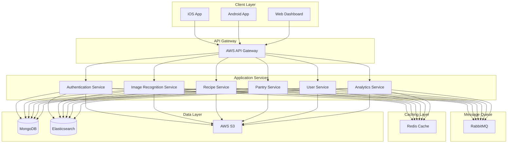

# PantryChef


## HUMAN TASKS
- [ ] Configure AWS credentials and access keys for all environments
- [ ] Set up MongoDB Atlas clusters for development/staging/production
- [ ] Configure Redis Enterprise clusters for caching layer
- [ ] Set up RabbitMQ clusters for message queuing
- [ ] Configure Elasticsearch clusters for recipe search
- [ ] Set up TensorFlow model deployment and versioning
- [ ] Configure SSL certificates and security settings
- [ ] Set up monitoring and alerting with CloudWatch
- [ ] Configure CI/CD pipelines in GitHub Actions
- [ ] Set up Docker registry access and credentials

## Overview

PantryChef is a comprehensive mobile-first kitchen management and recipe discovery platform that leverages cutting-edge image recognition technology and personalized recommendations to transform how users manage their kitchen inventory and discover recipes.

### Core Features

- 📸 **Photographic Ingredient Recognition**: Instantly identify and catalog ingredients using advanced image recognition
- 🔍 **Smart Recipe Matching**: Find perfect recipes based on available ingredients
- 📱 **Digital Pantry Management**: Track inventory with expiration dates and smart categorization
- 🎯 **Personalized Recommendations**: Get recipe suggestions based on preferences and habits
- 🛒 **Shopping List Management**: Generate and manage shopping lists automatically
- 👥 **Social Features**: Share recipes and cooking experiences with the community

## System Architecture

PantryChef follows a microservices architecture pattern deployed on AWS infrastructure:



## Technology Stack

### Mobile Applications
- **iOS**: Swift 5.0+, MVVM architecture
- **Android**: React Native, Redux
- **Shared**: TensorFlow Lite, WebSocket

### Backend Services
- **Runtime**: Node.js 16+
- **Framework**: Express.js
- **Database**: MongoDB 5.0+
- **Cache**: Redis 6.0+
- **Search**: Elasticsearch 8.0+
- **Queue**: RabbitMQ 3.9+

### Web Dashboard
- **Framework**: Next.js 13+
- **State**: Redux Toolkit
- **UI**: TailwindCSS
- **Real-time**: Socket.IO

### Infrastructure
- **Cloud**: AWS (ECS, S3, CloudFront)
- **CI/CD**: GitHub Actions
- **Containers**: Docker
- **Monitoring**: CloudWatch

## Getting Started

### Prerequisites

- Node.js >= 16.0.0
- MongoDB >= 5.0.0
- Redis >= 6.0.0
- Docker and Docker Compose
- AWS CLI configured
- Xcode 14+ (for iOS)
- Android Studio Arctic Fox+ (for Android)

### Installation

1. Clone the repository:
```bash
git clone https://github.com/your-org/pantrychef.git
cd pantrychef
```

2. Install backend dependencies:
```bash
cd src/backend
npm install
```

3. Set up environment variables:
```bash
cp .env.example .env
# Configure environment variables
```

4. Start development services:
```bash
docker-compose up -d
```

### Platform-Specific Setup

#### iOS Application
```bash
cd src/ios
pod install
open PantryChef.xcworkspace
```

#### Android Application
```bash
cd src/android
./gradlew assembleDebug
```

#### Web Dashboard
```bash
cd src/web
npm install
npm run dev
```

## Development

### Code Style Guidelines
- Follow language-specific style guides
- Use TypeScript for type safety
- Document public APIs
- Write unit tests for new features
- Follow Git commit conventions

### Testing Strategy
- Unit tests with Jest/XCTest/JUnit
- Integration tests for services
- E2E tests with Cypress/Detox
- Performance testing
- Security scanning

### Branching Strategy
- `main`: Production-ready code
- `develop`: Development branch
- `feature/*`: New features
- `bugfix/*`: Bug fixes
- `release/*`: Release preparation

## Deployment

### Infrastructure Setup

```bash
cd infrastructure/terraform
terraform init
terraform plan
terraform apply
```

### Container Deployment

```bash
# Build and push containers
docker-compose -f docker/docker-compose.yml build
docker-compose -f docker/docker-compose.yml push

# Deploy to ECS
aws ecs update-service --cluster pantrychef --service api --force-new-deployment
```

### Mobile App Deployment

```bash
# iOS
cd src/ios
fastlane release

# Android
cd src/android
fastlane deploy
```

## Security

- JWT authentication with OAuth2.0
- TLS 1.3 encryption
- AWS KMS for key management
- Regular security audits
- GDPR compliance
- Data encryption at rest

## Monitoring

- AWS CloudWatch metrics
- Application performance monitoring
- Error tracking and alerting
- Resource utilization tracking
- API latency monitoring
- User analytics

## Contributing

1. Fork the repository
2. Create a feature branch
3. Commit your changes
4. Push to the branch
5. Create a Pull Request

## License

This project is licensed under the MIT License - see the [LICENSE](LICENSE) file for details.

## Support

For technical support:
- Create an issue in the repository
- Contact the development team
- Check the documentation wiki

## Documentation

- [Backend Service](/src/backend/README.md)
- [iOS Application](/src/ios/README.md)
- [Android Application](/src/android/README.md)
- [Web Dashboard](/src/web/README.md)