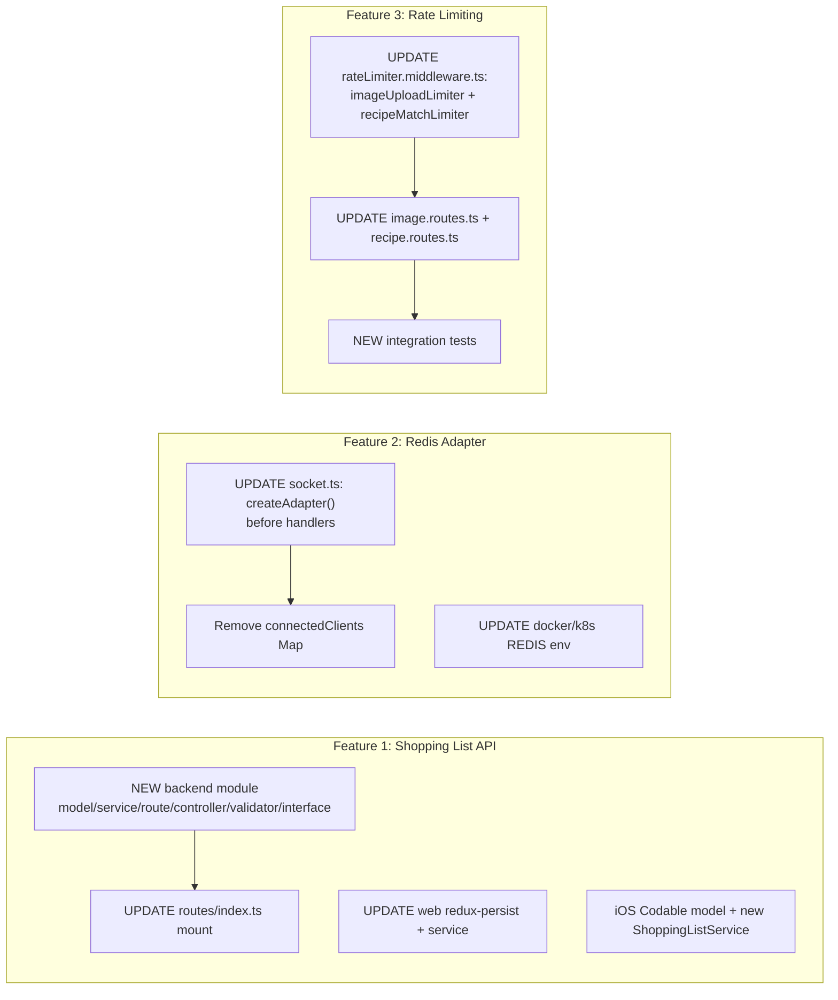

# Technical Specification

# 0. Agent Action Plan

## 0.1 Intent Clarification

This Agent Action Plan governs the addition of three discrete, backend-centric features to the existing **PantryChef** polyglot monorepo. The repository contains a TypeScript/Node.js backend at `src/backend`, a Next.js/React + Redux web client at `src/web`, and a native Swift/UIKit iOS client at `src/ios` [src/backend/src/app.ts:L13-L14]. All three features extend existing subsystems rather than introducing a new product surface.

### 0.1.1 Core Feature Objective

Based on the prompt, the Blitzy platform understands that the new feature requirement is to deliver the following three capabilities:

- **Feature 1 — Shopping List Backend Route and Cross-Device Synchronization.** Promote shopping lists from a client-only construct to a server-authoritative REST resource so that lists synchronize across a user's devices. Today the shopping list feature has a complete web and iOS implementation but, per the Feature Catalog, there is "no dedicated backend route observed," with persistence described as "iOS local; web transient (excluded from redux-persist whitelist)" [documentation/Technical Specifications.md:§2.1.7 F-007]. This feature closes that gap.

- **Feature 2 — Redis Adapter for WebSocket Multi-Node Fan-Out.** Replace the process-local, in-memory client registry in the Socket.IO server with the `@socket.io/redis-adapter` so that real-time broadcasts fan out correctly across multiple backend instances. The current server tracks connections in an in-memory `connectedClients` Map [src/backend/src/websocket/socket.ts:L31], which the specification flags as a high-severity gap: "WebSocket fan-out is single-node … no Socket.IO Redis adapter is configured. Horizontal scale will silently lose messages" [documentation/Technical Specifications.md:§6.3.5 Gap #2].

- **Feature 3 — Rate Limiting on Image Upload and Recipe Match Routes.** Introduce per-user, per-minute Redis-backed rate limits on the two abuse-prone POST endpoints — image upload and recipe match — returning HTTP 429 with a `Retry-After` header, and add integration tests covering the limit boundary and the retry header value.

The exact route contract requested by the user for Feature 1 is preserved verbatim below:

- User-specified routes: `GET /shopping-lists`, `POST /`, `PUT /:id`, `DELETE /:id`, `POST /:id/generate`, and `PATCH /:id/items/:itemId/toggle`.

**Implicit requirements surfaced.** The user's description names the headline files, but honoring the repository's established conventions requires several additional, unstated changes:

- Feature 1 must add a backend-side interface, controller, and validator to match the prevailing module shape — every existing route module pairs a router with a controller (`api/controllers`) and an express-validator chain (`api/validators`), and models are typed against interfaces in `src/backend/src/interfaces` [src/backend/src/api/controllers/pantry.controller.ts:L13]. The new router must also be registered in the central route aggregator `configureRoutes()` [src/backend/src/api/routes/index.ts:L90-L114], use the tsyringe DI pattern `container.resolve(...)` [src/backend/src/api/routes/pantry.routes.ts:L19,L32], and be gated by the `authenticate` middleware that scopes data to `req.user`.
- Feature 1's iOS sync requires `Codable` conformance and field mapping, because the iOS `ShoppingListItem` uses `isPurchased` (not `checked`) and `quantity: Double` (not a number), and lacks `category`, `recipeId`, `recipeName`, and `generationOptions` [src/ios/PantryChef/Models/ShoppingList.swift:L16-L22]. No iOS `ShoppingListService` exists today, so a new networking service is implied.
- Feature 2's adapter initialization is order-sensitive: it must run after `new Server(...)` [src/backend/src/websocket/socket.ts:L36-L48] but before the authentication middleware `io.use(...)` [src/backend/src/websocket/socket.ts:L71] and the `io.on('connection', ...)` handler [src/backend/src/websocket/socket.ts:L95], and the `connectedClients` set/delete usages [src/backend/src/websocket/socket.ts:L121,L175] must be removed in favor of room-scoped emits so fan-out works across nodes.
- Feature 3 implies library unification: the image upload route currently uses a different, IP-based library (`express-rate-limit`) inline [src/backend/src/api/routes/image.routes.ts:L11,L29-L35], whereas the canonical Redis-backed limiter (`rate-limiter-flexible`) already keys per user and emits `Retry-After` [src/backend/src/api/middlewares/rateLimiter.middleware.ts:L80,L90]. The new limiters reuse the canonical factory.

**Feature dependencies and prerequisites.** Feature 1 depends on the recipe subsystem as a generation source (F-002) and the pantry subsystem for inventory exclusion (F-003) [documentation/Technical Specifications.md:§2.1.7]; all three features depend on the existing Redis client factory `createRedisClient()` [src/backend/src/config/redis.ts:L69]. Authentication (F-005) is a universal prerequisite for the new authenticated routes.

### 0.1.2 Special Instructions and Constraints

The following directives are captured exactly as emphasized by the user and must constrain the implementation:

- **Reuse the existing CacheService with a 1-hour TTL** for the shopping list service. The `CacheService.set()` method defaults to a 3600-second TTL [src/backend/src/services/cache.service.ts:L21,L43].
- **Integrate with the existing pantry service for inventory exclusion.** The shopping list generation path must read the user's pantry via `PantryService.getPantry(userId)` [src/backend/src/services/pantry.service.ts:L84].
- **Reuse the existing Redis connection config from CacheService** for the WebSocket adapter — i.e., build the adapter's pub/sub clients from `createRedisClient()` [src/backend/src/config/redis.ts:L69], the same factory CacheService uses [src/backend/src/services/cache.service.ts:L26].
- **Initialize the Redis adapter before any handlers are registered**, and remove/deprecate the `connectedClients` Map [src/backend/src/websocket/socket.ts:L31].
- **Use the existing Redis-backed rate-limit store** (`RateLimiterRedis`) for the new limiters [src/backend/src/api/middlewares/rateLimiter.middleware.ts:L2].
- **Return HTTP 429 with a `Retry-After` header** on limit breach — already emitted by the canonical middleware [src/backend/src/api/middlewares/rateLimiter.middleware.ts:L90,L97-L107].
- **Remove the shopping Redux slice from the redux-persist exclusion list** in the web client; the slice is currently blacklisted [src/web/src/store/store.ts:L50].
- **Update Docker and Kubernetes env configs** to confirm Redis connectivity is available to the WebSocket server process.
- **Add integration tests** for the rate-limit boundary and the `Retry-After` header value.

Architectural conventions to follow (derived from the codebase, not optional): the module-per-domain layout (`interface → model → service → validator → controller → route`), tsyringe constructor injection with `@injectable()` services [src/backend/src/services/pantry.service.ts:L23], the unified success/error response envelope [documentation/Technical Specifications.md:§6.3.2.5], and the three-tier backend test layout (`tests/unit`, `tests/integration`, `tests/e2e`) [documentation/Technical Specifications.md:§6.6.1.1].

**Web search requirements.** One external lookup was required and conducted: confirming the `@socket.io/redis-adapter` version compatible with the project's `socket.io ^4.5.0` [src/backend/src/websocket/socket.ts:L1] and `ioredis ^5.0.0` [src/backend/src/config/redis.ts:L1]. The result is documented in §0.2.3 and §0.3.1.

### 0.1.3 Technical Interpretation

These feature requirements translate to the following technical implementation strategy:

- To deliver **Feature 1**, we will create a new shopping-list domain module in the backend (`shopping.interface.ts`, `shopping.model.ts`, `shopping.service.ts`, `shopping.validator.ts`, `shopping.controller.ts`, `shopping.routes.ts`), mirroring the pantry module's structure and DI wiring; register the router under `/api/v1/shopping-lists` in `configureRoutes()` [src/backend/src/api/routes/index.ts:L90-L114]; enable web persistence by editing the redux-persist configuration [src/web/src/store/store.ts:L49-L50]; reconcile the web service endpoint constants [src/web/src/services/shopping.service.ts:L23-L28]; and make the iOS `ShoppingList` model network-backed via `Codable` plus a new `ShoppingListService`.
- To deliver **Feature 2**, we will modify the WebSocket server to construct `pubClient = createRedisClient()` and `subClient = pubClient.duplicate()`, then call `this.io.adapter(createAdapter(pubClient, subClient))` immediately after the `Server` is instantiated and before handler registration [src/backend/src/websocket/socket.ts:L36-L48,L71,L95], remove the `connectedClients` Map and its usages [src/backend/src/websocket/socket.ts:L31,L121,L175], and ensure the discrete `REDIS_*` variables consumed by `createRedisClient()` are present for the WebSocket process in Docker and Kubernetes.
- To deliver **Feature 3**, we will add two exported limiter instances to the rate-limiter middleware — `imageUploadLimiter` (10 requests/user/minute) and `recipeMatchLimiter` (30 requests/user/minute) — built from the existing factory [src/backend/src/api/middlewares/rateLimiter.middleware.ts:L69]; apply `imageUploadLimiter` to the image upload POST route [src/backend/src/api/routes/image.routes.ts:L60-L63] and `recipeMatchLimiter` to the recipe match POST route [src/backend/src/api/routes/recipe.routes.ts:L113-L118]; and add an integration test asserting the boundary and `Retry-After` value.

The following diagram summarizes how each feature requirement maps onto the affected subsystems.




## 0.2 Repository Scope Discovery

This section enumerates every existing file that participates in the three features, the integration points that connect them, the external research performed, and the new files that must be created. PantryChef is a documentation-first monorepo: no `package.json`, `tsconfig.json`, or lockfiles are present in the working tree, and dependency versions are declared via inline `// @version` annotations in source files.

### 0.2.1 Comprehensive File Analysis

The backend follows a strict domain-module layout under `src/backend/src`: `interfaces/`, `models/`, `services/`, and `api/{routes,controllers,validators,middlewares}/`. Crucially, a `shopping` domain is absent from every one of these directories — `models`, `services`, `interfaces`, `api/routes`, `api/controllers`, and `api/validators` all contain `analytics`, `pantry`, `recipe`, and `user` peers but no `shopping` member. The following table lists the existing files that this change set touches or uses as templates.

| File | Role in This Change | Mode |
|------|---------------------|------|
| `src/web/src/interfaces/shopping.interface.ts` | Source-of-truth contract: `ShoppingListItem` [L18-L28], `ShoppingList` [L34-L41], `ShoppingListGenerationOptions` [L58-L63] | REFERENCE |
| `src/backend/src/services/cache.service.ts` | 1-hour-TTL cache reused by shopping service; `set()` [L43], `get()` [L77], default TTL 3600 [L21] | REFERENCE |
| `src/backend/src/services/pantry.service.ts` | `getPantry(userId)` for inventory exclusion [L84] | REFERENCE |
| `src/backend/src/models/pantry.model.ts` | Mongoose schema template (mongoose `^6.0.0` [L1], `userId` indexed) | REFERENCE |
| `src/backend/src/api/routes/pantry.routes.ts` | tsyringe router template (`container.resolve` [L32], `router.use(authenticate)`) | REFERENCE |
| `src/backend/src/api/controllers/pantry.controller.ts` | Controller template (`@injectable()` [L23]) | REFERENCE |
| `src/backend/src/config/redis.ts` | `createRedisClient()` [L69] reused for adapter pub/sub clients | REFERENCE |
| `src/backend/src/api/routes/index.ts` | `configureRoutes()` mount point; `API_VERSION='/api/v1'` [L90]; CORS allows `PATCH` [L67] | UPDATE |
| `src/backend/src/websocket/socket.ts` | Socket.IO server; `connectedClients` Map [L31], `Server` ctor [L36-L48], `io.use` [L71], `io.on` [L95] | UPDATE |
| `src/backend/src/api/middlewares/rateLimiter.middleware.ts` | `RateLimiterRedis` factory [L2,L69]; per-user key [L80]; `Retry-After` [L90] | UPDATE |
| `src/backend/src/api/routes/image.routes.ts` | Inline `express-rate-limit` upload limiter [L29-L35]; POST upload [L60-L63] | UPDATE |
| `src/backend/src/api/routes/recipe.routes.ts` | `POST /match` with inline 30/hour limiter [L113-L118] | UPDATE |
| `src/web/src/store/store.ts` | redux-persist `whitelist` [L49] / `blacklist:['shopping']` [L50] | UPDATE |
| `src/web/src/services/shopping.service.ts` | Web REST adapter; endpoint constants [L23-L28] | UPDATE |
| `src/web/src/store/slices/shoppingSlice.ts` | Existing thunks already calling the shopping API | REFERENCE |
| `src/ios/PantryChef/Models/ShoppingList.swift` | iOS model; `isPurchased`/`Double` fields [L16-L22] | UPDATE |
| `src/backend/src/app.ts` | Boots HTTP + WebSocket in one process [L115-L119] | REFERENCE |

A noteworthy pre-existing artifact: the route aggregator contains a non-standard import line, `import router as pantryRouter from './pantry.routes';` [src/backend/src/api/routes/index.ts:L13]; the new shopping import should use valid syntax and not replicate this pattern.

### 0.2.2 Integration Point Discovery

The change set connects to the following existing integration points:

- **API endpoints / route aggregation.** The new shopping router is mounted in `configureRoutes()` alongside `recipes` [src/backend/src/api/routes/index.ts:L108], `pantry` [src/backend/src/api/routes/index.ts:L111], and `users` [src/backend/src/api/routes/index.ts:L114]. The CORS configuration already permits the `PATCH` verb required by the toggle route [src/backend/src/api/routes/index.ts:L67].
- **Database models.** A new Mongoose model joins the existing set; there is no `models/index.ts` barrel, so consumers import the model directly (e.g., `import { PantryModel } from '../models/pantry.model'` [src/backend/src/services/pantry.service.ts:L16]) — no barrel update is required.
- **Service classes and DI.** Services are `@injectable()` [src/backend/src/services/pantry.service.ts:L23] and controllers are resolved through tsyringe `container.resolve(...)` [src/backend/src/api/routes/pantry.routes.ts:L32]; there is no central container-registration file, so the new service/controller are auto-resolved by reflection.
- **Cache + pantry services.** The shopping service composes `CacheService` (1-hour TTL) [src/backend/src/services/cache.service.ts:L43] and `PantryService.getPantry()` [src/backend/src/services/pantry.service.ts:L84].
- **Middleware.** New data routes are gated by the existing `authenticate` middleware; rate limiters are layered with `authenticate` on the image upload [src/backend/src/api/routes/image.routes.ts:L60-L63] and recipe match [src/backend/src/api/routes/recipe.routes.ts:L113-L118] routes. The 429 response flows through the unified error middleware [documentation/Technical Specifications.md:§6.3.2.5].
- **WebSocket.** The adapter attaches via `this.io.adapter(...)` and relies on the room-scoped emit pattern already present for `recipe:${userId}` rooms [documentation/Technical Specifications.md:§6.3.2.1] so broadcasts survive across nodes once the in-memory map is removed.
- **Web Redux store.** The web client already enumerates a `SHOPPING` endpoint constant and ships a `shoppingSlice` with CRUD/generate thunks [documentation/Technical Specifications.md:§6.3.6.3]; only the persistence configuration and endpoint paths need to change.
- **Infrastructure env.** The WebSocket server runs in the same Node process as the HTTP API [src/backend/src/app.ts:L115-L119], so it inherits the backend's Redis environment. `createRedisClient()` reads discrete `REDIS_HOST`/`REDIS_PORT`/`REDIS_PASSWORD` [src/backend/.env.example:L45-L49], which Kubernetes provides via `configmap.yaml` (`REDIS_HOST`, `REDIS_PORT`) [infrastructure/kubernetes/configmap.yaml:L27-L28] and the backend deployment injects through `envFrom` [infrastructure/kubernetes/backend-deployment.yaml:L98-L102]. The Docker Compose files instead set `REDIS_URL`, which the code does not read — a reconciliation item noted in §0.5.

### 0.2.3 Web Search Research Conducted

A single targeted web search was performed to select the correct adapter version for Feature 2:

- **Best-practice adapter selection for multi-node Socket.IO fan-out.** The official `@socket.io/redis-adapter` is the recommended mechanism, and the specification's own hardening roadmap names it explicitly [documentation/Technical Specifications.md:§6.3.7.2].
- **Version compatibility.** The adapter's compatibility matrix maps adapter `7.x` and above to Socket.IO server `4.3.1` and above, and the `8.x` line added support for `ioredis` v5. With the project on `socket.io ^4.5.0` and `ioredis ^5.0.0`, the latest stable `@socket.io/redis-adapter ^8.3.0` is the correct, compatible choice. It is MIT-licensed, consistent with the project's npm OSS posture [documentation/Technical Specifications.md:§3.3.2].
- **Recommended initialization pattern (ioredis).** Construct `pubClient` and a duplicated `subClient`, then attach via `io.adapter(createAdapter(pubClient, subClient))` — aligning with the user's instruction to reuse the existing Redis connection config.

No other research was required; Features 1 and 3 are built entirely from libraries already present in the codebase.

### 0.2.4 New File Requirements

The following new files must be created. Backend source files mirror the pantry/recipe module conventions; test files follow the three-tier backend layout [documentation/Technical Specifications.md:§6.6.1.1].

| New File | Purpose | Feature |
|----------|---------|---------|
| `src/backend/src/interfaces/shopping.interface.ts` | Server-side `IShoppingList` / `IShoppingListItem` / `IShoppingListGenerationOptions` matching the web contract | F1 |
| `src/backend/src/models/shopping.model.ts` | Mongoose item sub-schema + list schema (`userId` indexed, `items[]`, `generationOptions`, `{timestamps:true}`) | F1 |
| `src/backend/src/services/shopping.service.ts` | `@injectable()` CRUD + generate (pantry exclusion) + toggle; CacheService-backed | F1 |
| `src/backend/src/api/validators/shopping.validator.ts` | express-validator chains for create/update/generate/toggle | F1 |
| `src/backend/src/api/controllers/shopping.controller.ts` | `@injectable()` request handlers returning the unified envelope | F1 |
| `src/backend/src/api/routes/shopping.routes.ts` | Router with the six user-specified routes, `authenticate`, tsyringe resolution | F1 |
| `src/ios/PantryChef/Services/ShoppingListService.swift` | `NetworkService`-based REST client for server sync (none exists today) | F1 |
| `src/backend/tests/integration/rateLimiter.test.ts` | Limit-boundary + `Retry-After` header assertions (prompt-mandated) | F3 |
| `src/backend/tests/integration/shopping.test.ts` | Real-infrastructure CRUD/generate/toggle coverage | F1 |
| `src/backend/tests/e2e/shopping.test.ts` | SuperTest HTTP coverage incl. auth and ownership isolation | F1 |
| `src/backend/tests/unit/services/shopping.service.test.ts` | Service unit tests with mocked CacheService/PantryService | F1 |

No new configuration files or environment variables are introduced; Feature 2 reuses the existing discrete `REDIS_*` variables [src/backend/.env.example:L45-L49].


## 0.3 Dependency Inventory and Integration Analysis

This change set introduces exactly one new third-party dependency; all other required libraries are already declared in the codebase. The remainder of the integration surface is internal.

### 0.3.1 Dependency Changes

The only package addition is the Socket.IO Redis adapter for Feature 2. It must be declared per the repository's inline `// @version` annotation convention in `socket.ts` and, where an npm manifest exists, added to the backend `dependencies` block (the project consumes npm for the backend per [documentation/Technical Specifications.md:§3.3.1]).

| Registry | Package | Version | Purpose |
|----------|---------|---------|---------|
| npm | `@socket.io/redis-adapter` | `^8.3.0` | Cross-instance WebSocket broadcast via Redis Pub/Sub; compatible with `socket.io ^4.5.0` and `ioredis ^5.0.0` (F2) |

No dependency updates and no removals are required:

- All libraries Features 1 and 3 need are already present: `rate-limiter-flexible ^2.4.1` [src/backend/src/api/middlewares/rateLimiter.middleware.ts:L2], `ioredis ^5.0.0` [src/backend/src/config/redis.ts:L1], `mongoose ^6.0.0` [src/backend/src/models/pantry.model.ts:L1], `tsyringe ^3.0.0` [src/backend/src/services/notification.service.ts:L1], `socket.io ^4.5.0` [src/backend/src/websocket/socket.ts:L1], and the web stack `@reduxjs/toolkit ^1.9.5` / `redux-persist ^6.0.0` / `axios ^1.4.0` [src/web/src/store/store.ts:L9-L10].
- `express-rate-limit ^6.7.0` [src/backend/src/api/routes/image.routes.ts:L11] remains a dependency even after Feature 3, because the unrelated `recognitionRateLimiter` on the recognition GET route continues to use it; it is therefore not removed.

### 0.3.2 Integration Touchpoints

The following table maps each feature to the existing code it integrates with and the nature of the touch.

| Feature | Existing Integration Target | Interaction |
|---------|----------------------------|-------------|
| F1 | `CacheService.set/get` [src/backend/src/services/cache.service.ts:L43,L77] | Cache shopping lists at the default 1-hour TTL; invalidate on mutation |
| F1 | `PantryService.getPantry(userId)` [src/backend/src/services/pantry.service.ts:L84] | Subtract on-hand inventory during list generation when `excludeInventoryItems` is set |
| F1 | tsyringe `container.resolve` [src/backend/src/api/routes/pantry.routes.ts:L32] | Resolve the new `ShoppingController`; service is `@injectable()` |
| F1 | `configureRoutes()` [src/backend/src/api/routes/index.ts:L90-L114] | Mount the router at `/api/v1/shopping-lists` |
| F1 | redux-persist config [src/web/src/store/store.ts:L49-L50] | Move `shopping` from `blacklist` to `whitelist` to persist list state |
| F2 | `createRedisClient()` [src/backend/src/config/redis.ts:L69] | Build `pubClient`; `subClient = pubClient.duplicate()` |
| F2 | `new Server(...)` / `io.use` / `io.on` [src/backend/src/websocket/socket.ts:L36-L48,L71,L95] | Attach adapter after server construction, before handler registration |
| F2 | Docker/K8s Redis env [infrastructure/kubernetes/configmap.yaml:L27-L28] | Confirm discrete `REDIS_*` vars reach the WebSocket process |
| F3 | `rateLimiterMiddleware(...)` factory [src/backend/src/api/middlewares/rateLimiter.middleware.ts:L69] | Instantiate `imageUploadLimiter` and `recipeMatchLimiter` |
| F3 | Image/recipe routes [src/backend/src/api/routes/image.routes.ts:L60-L63], [src/backend/src/api/routes/recipe.routes.ts:L113-L118] | Apply new limiters alongside `authenticate` |
| F3 | SuperTest integration harness [documentation/Technical Specifications.md:§6.6.1.2] | New tests use `TEST_REDIS_URI` and the real Express app |

No new application environment variables are introduced. Feature 2 relies solely on the existing discrete Redis variables (`REDIS_HOST`, `REDIS_PORT`, `REDIS_PASSWORD`, `REDIS_DB`, `REDIS_CLUSTER_MODE`) [src/backend/.env.example:L45-L49].


## 0.4 Technical Implementation

This section specifies, file by file, exactly what is created or modified, the approach for each change, and the resulting user-interface behavior. Every file listed here is in scope and must be created or modified.

### 0.4.1 File-by-File Execution Plan

**Group 1 — Feature 1: Shopping List Backend Route and Cross-Device Sync**

| Mode | File | Change |
|------|------|--------|
| CREATE | `src/backend/src/interfaces/shopping.interface.ts` | Define `IShoppingListItem`, `IShoppingList`, `IShoppingListGenerationOptions` mirroring the web contract [src/web/src/interfaces/shopping.interface.ts:L18-L28,L34-L41,L58-L63] |
| CREATE | `src/backend/src/models/shopping.model.ts` | Mongoose item sub-schema + list schema; `userId` indexed; `{timestamps:true}` |
| CREATE | `src/backend/src/services/shopping.service.ts` | `@injectable()` service: `getLists`, `getList`, `create`, `update`, `delete`, `generate`, `toggleItem` |
| CREATE | `src/backend/src/api/validators/shopping.validator.ts` | express-validator chains for each mutating route |
| CREATE | `src/backend/src/api/controllers/shopping.controller.ts` | `@injectable()` handlers returning the unified envelope |
| CREATE | `src/backend/src/api/routes/shopping.routes.ts` | Router with the six user-specified routes + `authenticate` + tsyringe resolution |
| UPDATE | `src/backend/src/api/routes/index.ts` | Import and mount `shoppingRouter` at `/api/v1/shopping-lists` (near [L114]) |
| UPDATE | `src/web/src/store/store.ts` | Remove `shopping` from `blacklist` [L50]; add to `whitelist` [L49] |
| UPDATE | `src/web/src/services/shopping.service.ts` | Reconcile endpoint constants [L23-L28] to the new route contract |
| UPDATE | `src/ios/PantryChef/Models/ShoppingList.swift` | Add `Codable` + field mapping (`isPurchased`↔`checked`) [L16-L22] |
| CREATE | `src/ios/PantryChef/Services/ShoppingListService.swift` | `NetworkService`-based REST sync client |

**Group 2 — Feature 2: Redis Adapter for WebSocket Fan-Out**

| Mode | File | Change |
|------|------|--------|
| UPDATE | `src/backend/src/websocket/socket.ts` | Add adapter import + `// @version` annotation; attach adapter before handlers [L36-L48]; remove `connectedClients` Map + usages [L31,L121,L175] |
| UPDATE | `src/backend/docker/docker-compose.yml` | Provide discrete `REDIS_HOST`/`REDIS_PORT` for the backend/WS process |
| UPDATE | `src/backend/docker/docker-compose.dev.yml` | Same as above for the dev compose |
| UPDATE | `infrastructure/docker/docker-compose.yml` | Same as above for the infra compose |
| UPDATE | `infrastructure/docker/backend.dockerfile` | Align Redis env with discrete-variable contract |
| UPDATE | `infrastructure/kubernetes/configmap.yaml` | Confirm `REDIS_HOST`/`REDIS_PORT` reach the process [L27-L28] |

**Group 3 — Feature 3: Rate Limiting**

| Mode | File | Change |
|------|------|--------|
| UPDATE | `src/backend/src/api/middlewares/rateLimiter.middleware.ts` | Export `imageUploadLimiter` (10/user/min) and `recipeMatchLimiter` (30/user/min); remove pre-existing stray-backtick artifact |
| UPDATE | `src/backend/src/api/routes/image.routes.ts` | Replace the inline `express-rate-limit` upload limiter with `imageUploadLimiter` [L60-L63] |
| UPDATE | `src/backend/src/api/routes/recipe.routes.ts` | Replace the inline 30/hour limiter on `POST /match` with `recipeMatchLimiter` [L113-L118] |
| CREATE | `src/backend/tests/integration/rateLimiter.test.ts` | Limit-boundary + `Retry-After` assertions |

### 0.4.2 Implementation Approach per File

- **Establish the shopping foundation.** Create `shopping.interface.ts` first so the model, service, and controller share consistent types; field names match the web `ShoppingListItem` (`name`, `quantity`, `unit`, `category`, `checked`, `notes`, `recipeId`, `recipeName`) [src/web/src/interfaces/shopping.interface.ts:L18-L28]. Build `shopping.model.ts` by replicating the pantry model's sub-schema pattern with a `userId` index and `{timestamps:true}`. Implement `shopping.service.ts` as an `@injectable()` class that injects `CacheService` and `PantryService`; the `generate()` method calls `PantryService.getPantry(userId)` [src/backend/src/services/pantry.service.ts:L84] and subtracts matching inventory when `excludeInventoryItems` is true, merging duplicates, and caches results via `CacheService.set()` at the default 3600-second TTL [src/backend/src/services/cache.service.ts:L43].

- **Expose the routes.** `shopping.routes.ts` builds a `Router`, applies `router.use(authenticate)`, resolves the controller via `container.resolve(ShoppingController)` [src/backend/src/api/routes/pantry.routes.ts:L32], and binds the six routes exactly as specified. `routes/index.ts` imports the router with valid syntax and mounts it; because CORS already lists `PATCH` [src/backend/src/api/routes/index.ts:L67], the toggle route works without further CORS changes.

- **Wire the clients.** In `store.ts`, move `'shopping'` from `blacklist` [L50] to `whitelist` [L49] so list state persists; the existing `shoppingSlice` thunks continue to drive the API. In the web `shopping.service.ts`, align endpoint constants [L23-L28] to the new `/api/v1/shopping-lists` contract. On iOS, make `ShoppingList`/`ShoppingListItem` `Codable`, add the missing fields, map `isPurchased`↔`checked`, and add `ShoppingListService.swift` using the `NetworkService.shared` Combine pattern.

- **Attach the Redis adapter.** In `socket.ts`, immediately after the `Server` is constructed [L36-L48] and before `io.use` [L71] / `io.on('connection')` [L95]:

```typescript
const pubClient = createRedisClient();
const subClient = pubClient.duplicate();
this.io.adapter(createAdapter(pubClient, subClient));
```

Then remove the `connectedClients` field [L31] and its set/delete calls [L121,L175], relying on room-scoped emits for cross-node delivery.

- **Define the limiters.** In `rateLimiter.middleware.ts`, add two instances built from the existing factory [L69]:

```typescript
export const imageUploadLimiter = rateLimiterMiddleware({ points: 10, duration: 60, keyPrefix: 'image:upload' });
export const recipeMatchLimiter = rateLimiterMiddleware({ points: 30, duration: 60, keyPrefix: 'recipe:match' });
```

Because the factory already keys by `req.user?.id || req.ip` [L80] and sets `Retry-After` on breach [L90], per-user enforcement and the retry header come for free. Apply `imageUploadLimiter` to the image upload route [src/backend/src/api/routes/image.routes.ts:L63] and `recipeMatchLimiter` to `POST /match` [src/backend/src/api/routes/recipe.routes.ts:L115-L118].

- **Prove the behavior.** `rateLimiter.test.ts` uses SuperTest against the real Express app, sending requests up to and beyond each limit (the 11th upload and 31st match within the window) to assert a 429 status and a positive numeric `Retry-After` header, reading Redis connectivity from `TEST_REDIS_URI` per the integration-test convention [documentation/Technical Specifications.md:§6.6.1.2].

- **Reference for Figma URLs.** No Figma URLs were provided; no files reference design assets.

### 0.4.3 User Interface Design

The user-facing impact is behavioral rather than visual; no new screens, components, or design tokens are introduced, and no component library or Figma source was supplied.

- **Web.** There is no change to any React component. The only user-perceptible difference is that shopping list state now persists across sessions (via the redux-persist whitelist change) and is synchronized server-side through the existing `shoppingSlice` thunks. The shopping list UI already exists [documentation/Technical Specifications.md:§2.1.7].
- **iOS.** The `ShoppingList` model becomes network-backed; existing views and view models keep their interfaces, but list data now persists server-side and syncs across the user's devices instead of remaining local-only [src/ios/PantryChef/Models/ShoppingList.swift:L16-L22].
- **Real-time fan-out.** Feature 2 has no visible UI surface; it ensures existing real-time pantry/recipe updates are delivered correctly when more than one backend instance is running.


## 0.5 Scope Boundaries

This section draws the precise boundary between what this change set delivers and what it deliberately leaves untouched.

### 0.5.1 Exhaustively In Scope

- **New backend shopping module:** `src/backend/src/interfaces/shopping.interface.ts`, `src/backend/src/models/shopping.model.ts`, `src/backend/src/services/shopping.service.ts`, `src/backend/src/api/validators/shopping.validator.ts`, `src/backend/src/api/controllers/shopping.controller.ts`, `src/backend/src/api/routes/shopping.routes.ts`.
- **Backend modifications:** `src/backend/src/api/routes/index.ts` (router mount), `src/backend/src/websocket/socket.ts` (Redis adapter), `src/backend/src/api/middlewares/rateLimiter.middleware.ts` (two new limiters + artifact cleanup), `src/backend/src/api/routes/image.routes.ts` (apply `imageUploadLimiter`), `src/backend/src/api/routes/recipe.routes.ts` (apply `recipeMatchLimiter`).
- **Backend tests:** `src/backend/tests/integration/rateLimiter.test.ts` (prompt-mandated) plus shopping coverage `src/backend/tests/**/*shopping*.test.ts` (unit, integration, e2e).
- **Web modifications:** `src/web/src/store/store.ts` (persist whitelist/blacklist), `src/web/src/services/shopping.service.ts` (endpoint reconciliation).
- **iOS:** `src/ios/PantryChef/Models/ShoppingList.swift` (Codable + fields), `src/ios/PantryChef/Services/ShoppingListService.swift` (new sync client).
- **Infrastructure (Redis env for the WebSocket process):** `src/backend/docker/docker-compose.yml`, `src/backend/docker/docker-compose.dev.yml`, `infrastructure/docker/docker-compose.yml`, `infrastructure/docker/backend.dockerfile`, `infrastructure/kubernetes/configmap.yaml`.
- **Dependency declaration:** `@socket.io/redis-adapter ^8.3.0` added per the repository's `// @version` convention (and to the backend npm manifest where present).

### 0.5.2 Explicitly Out of Scope

- The `recognitionRateLimiter` on `GET /images/recognition/:id` and all other recipe-route limiters (e.g., `POST /`, `GET /search`) — the prompt names only the image upload and recipe match routes [src/backend/src/api/routes/image.routes.ts:L38-L44], [src/backend/src/api/routes/recipe.routes.ts:L53-L105].
- Fixing the WebSocket authentication stub (`verifyToken()` returns the literal `'userId'`) [documentation/Technical Specifications.md:§6.3.5 Gap #1] — a separate concern from fan-out.
- The iOS Starscream-to-Socket.IO client migration and iOS real-time auth [documentation/Technical Specifications.md:§6.3.5 Gap #9].
- The Android client — no shopping changes were requested for it.
- Unrelated specification gaps: OAuth stubs, Spoonacular/Stripe integration, AWS region drift, and the health-probe path mismatch [documentation/Technical Specifications.md:§6.3.5].
- Refactoring `config/redis.ts` to read `REDIS_URL`; the change only ensures the existing discrete `REDIS_*` variables are present where the WebSocket process runs.
- Performance optimizations and refactors beyond what the three features require.

**Reconciliation flags (documented, not silently expanded).** Two pre-existing conditions affect runtime behavior and are flagged for follow-up rather than assumed into scope:

- The image router (`configureImageRoutes`, default export [src/backend/src/api/routes/image.routes.ts:L130]) is not currently mounted in `routes/index.ts` or `app.ts`; for `imageUploadLimiter` to take effect at runtime, the router must be mounted. The limiter wiring is still implemented as specified.
- The user-specified route contract (`/shopping-lists`, `POST /:id/generate`, `PATCH /:id/items/:itemId/toggle`) differs from the existing web client's endpoint constants (`/api/v1/shopping/lists`, `/generate`, item `PUT`) [src/web/src/services/shopping.service.ts:L23-L28]. The prompt is authoritative; the web constants are reconciled to it in scope.


## 0.6 Rules for Feature Addition

No standalone user-specified implementation rules were provided (the project rules list is empty). The binding requirements below are therefore drawn from directives the user emphasized in the feature description and from conventions the existing codebase enforces.

- **Reuse, do not reinvent, shared infrastructure.** Shopping list caching must use the existing `CacheService` at a 1-hour TTL [src/backend/src/services/cache.service.ts:L43], and the WebSocket adapter must build its clients from the existing `createRedisClient()` factory [src/backend/src/config/redis.ts:L69]. No parallel Redis client or cache abstraction may be introduced.
- **Follow the domain-module convention.** The new shopping feature must replicate the established `interface → model → service → validator → controller → route` layout with tsyringe `@injectable()` services and `container.resolve(...)` routing [src/backend/src/services/pantry.service.ts:L23], [src/backend/src/api/routes/pantry.routes.ts:L32].
- **Authenticate and scope by user.** Every shopping route must sit behind the `authenticate` middleware, and list operations must be scoped to the authenticated user, consistent with the bearer-JWT model on REST surfaces [documentation/Technical Specifications.md:§6.3.1.2].
- **Preserve the route contract exactly.** The six routes must be implemented with the verbs and paths the user specified, including the `PATCH` toggle route.
- **Integrate with the pantry for inventory exclusion.** Generation must honor `excludeInventoryItems` by reading the user's pantry [src/backend/src/services/pantry.service.ts:L84].
- **Initialize the Redis adapter before any handlers register**, and remove the now-obsolete in-memory `connectedClients` Map [src/backend/src/websocket/socket.ts:L31] so broadcasts fan out across nodes.
- **Enforce limits per user, per minute, with a `Retry-After` header**, returning HTTP 429 through the existing unified error envelope [src/backend/src/api/middlewares/rateLimiter.middleware.ts:L90,L97-L107].
- **Maintain cross-platform contract consistency.** The backend model must align with the web `ShoppingListItem` shape, and the iOS field divergence (`isPurchased`/`Double`) must be reconciled via explicit mapping rather than schema drift [src/ios/PantryChef/Models/ShoppingList.swift:L16-L22].
- **Test the rate limits.** Integration tests must assert both the limit boundary and the `Retry-After` value, following the backend integration-test conventions [documentation/Technical Specifications.md:§6.6.1.2].
- **Respect performance budgets.** New endpoints should observe the platform's sub-200 ms API budget (NFR-P8); cache reads should keep repeated list fetches fast [documentation/Technical Specifications.md:§6.6.3.3].


## 0.7 Attachments

No attachments were provided with this request.

- **Files:** None. The `review_attachments` check returned no project attachments (no PDFs, images, or documents).
- **Figma screens:** None. No Figma frames or URLs were supplied, so no design-to-component mapping or design-system catalog is applicable to this change set.

All reference material for this plan derives from the repository source files and the existing Technical Specification sections cited inline throughout §0.1–§0.6.


