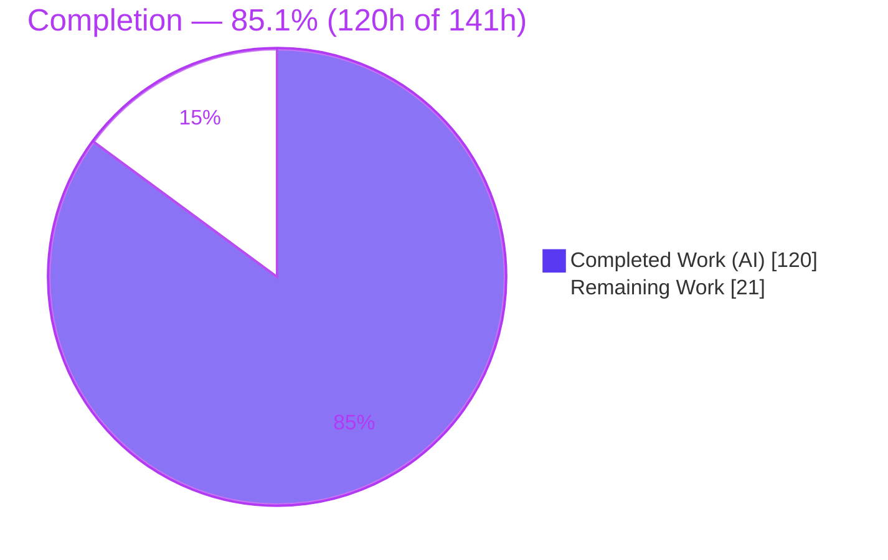
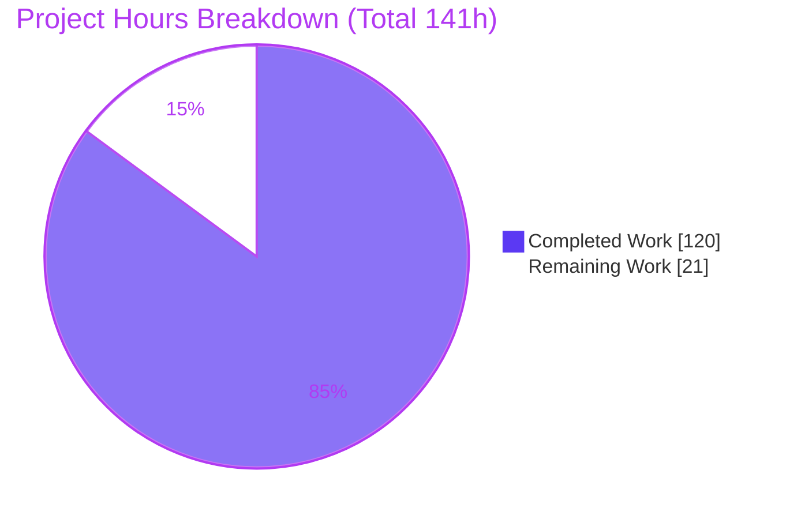
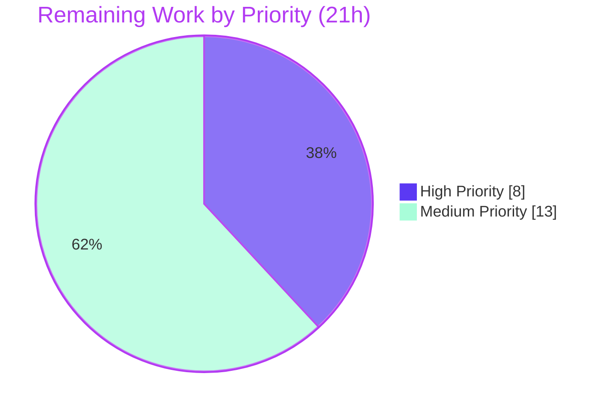

# PantryChef — Blitzy Project Guide

> Three backend-centric features added to the PantryChef polyglot monorepo: **(F1)** server-authoritative Shopping List API with cross-device sync, **(F2)** Redis adapter for multi-node WebSocket fan-out, and **(F3)** per-user rate limiting on the image-upload and recipe-match routes.

---

## 1. Executive Summary

### 1.1 Project Overview

PantryChef is a polyglot monorepo (TypeScript/Node.js backend, Next.js/React + Redux web client, native Swift/UIKit iOS client) serving home cooks who manage pantry inventory, discover recipes, and build shopping lists. This change set extends three existing subsystems without introducing a new product surface: it promotes shopping lists from a client-only construct to a **server-authoritative REST resource** that synchronizes across a user's devices (F1), wires a **Redis pub/sub adapter** into the Socket.IO server so real-time broadcasts fan out across multiple backend instances (F2), and adds **per-user, per-minute rate limits** (HTTP 429 + `Retry-After`) to the abuse-prone image-upload and recipe-match endpoints (F3). The business impact is durable cross-device shopping lists, horizontally scalable real-time messaging, and abuse protection on costly endpoints.

### 1.2 Completion Status

The project is **85.1% complete** on an AAP-scoped basis. All autonomous engineering — every in-scope source file, the new dependency, and the full test suite — is implemented, compiles cleanly, and passes 100% of its tests. The remaining 21 hours are **human-only, path-to-production activities** that cannot be performed autonomously on a Linux build host (iOS Xcode build/verification, multi-node and browser end-to-end verification, production deployment, and human code review), plus one flagged architectural decision (mounting the image router).



| Metric | Hours |
|--------|-------|
| **Total Hours** | **141** |
| Completed Hours (AI = 120 + Manual = 0) | **120** |
| Remaining Hours | **21** |
| **Percent Complete** | **85.1%** |

> Completed work is **100% AI-authored** — 36 commits, all by `agent@blitzy.com`. Manual hours to date = 0.

### 1.3 Key Accomplishments

- ✅ **Feature 1 — Shopping List backend module** created across all six domain layers (`interface → model → service → validator → controller → route`), mounted at `/api/v1/shopping-lists`, gated by `authenticate`, resolved via tsyringe DI, and reusing `CacheService` (1-hour TTL) + `PantryService.getPantry()` for inventory exclusion.
- ✅ **Feature 1 — Six routes implemented verbatim** to the user contract (`GET /shopping-lists`, `POST /`, `PUT /:id`, `DELETE /:id`, `POST /:id/generate`, `PATCH /:id/items/:itemId/toggle`).
- ✅ **Feature 1 — Web + iOS clients reconciled**: web `shopping` slice moved into the redux-persist whitelist (with a transient-state transform); iOS `ShoppingList`/`ShoppingListItem` made `Codable` with explicit `isPurchased ↔ checked` mapping; new `ShoppingListService.swift` (NetworkService + Combine) covering all six routes.
- ✅ **Feature 2 — `@socket.io/redis-adapter ^8.3.0`** attached via `createAdapter(pubClient, subClient)` immediately after `new Server(...)` and before handler registration; the in-memory `connectedClients` Map fully removed; runtime-confirmed adapter initialization.
- ✅ **Feature 3 — `imageUploadLimiter` (10/user/min)** and **`recipeMatchLimiter` (30/user/min)** built from the canonical Redis-backed factory, returning HTTP 429 with a numeric `Retry-After` header.
- ✅ **61 of 61 automated tests passing** across 4 suites (independently re-verified this session).
- ✅ **Clean compile and build**: `tsc --noEmit` = 0 errors; `npm run build` = 0 errors (222 dist files); all 6 new shopping files + the rate-limiter middleware are ESLint-clean.
- ✅ **Runtime validated** end-to-end: HTTP `/health` → 200, JWT auth enforced (401 without token), user-scoped shopping CRUD via the unified response envelope, server-authoritative persistence, and the Redis WebSocket adapter all operational with zero boot errors.

### 1.4 Critical Unresolved Issues

| Issue | Impact | Owner | ETA |
|-------|--------|-------|-----|
| Image router not mounted in `routes/index.ts`/`app.ts` | `imageUploadLimiter` is wired and proven by integration test but inert at runtime until the router is mounted (flagged in AAP §0.5.2 as a human decision) | Backend team | 0.5 day |
| iOS not built/tested on device | iOS source is authored and structurally reviewed but never compiled in Xcode (no macOS on the Linux host); latent Swift/`Codable` issues could surface only on build | iOS team | 1 day |
| Multi-node WebSocket fan-out unverified | Adapter is wired and single-node boot confirmed; cross-node broadcast not yet exercised with 2+ instances | DevOps + Backend | 0.5 day |

> No issue above blocks the AAP deliverable itself — each is a path-to-production verification or a documented design decision. There are **no unresolved in-scope code defects**.

### 1.5 Access Issues

| System/Resource | Type of Access | Issue Description | Resolution Status | Owner |
|-----------------|----------------|-------------------|-------------------|-------|
| macOS + Xcode toolchain | Build/test environment | iOS Swift code cannot be compiled or simulator-tested on the Linux build host | Open — requires macOS CI runner or developer workstation | iOS team |
| Production Redis (HA/cluster) | Service credentials/endpoint | Multi-node fan-out + rate limiting depend on a shared, highly-available Redis not provisioned in this environment | Open — provision in target environment | DevOps |
| Production secrets (`JWT_SECRET`, `REDIS_PASSWORD`) | Secret material | Must be injected via secret manager / K8s secrets; not present in repo (correctly) | Open — standard deployment step | DevOps |

> Local development access (Node 20, npm 11, Docker 28, Redis, MongoDB) is fully available and was used to validate the build, tests, and runtime this session.

### 1.6 Recommended Next Steps

1. **[High]** Mount the image router (`configureImageRoutes`) into `routes/index.ts` so `imageUploadLimiter` takes effect at runtime — or formally defer with sign-off (AAP §0.5.2). *(~2h)*
2. **[High]** Build the iOS app in Xcode on macOS, resolve any Swift/`Codable` compile issues, run iOS unit/UI tests, and verify shopping sync against a live backend. *(~6h)*
3. **[Medium]** Provision the production environment (managed Redis HA, secrets, `ALLOWED_ORIGINS`), apply the Docker/K8s configs, and run smoke tests. *(~4h)*
4. **[Medium]** Verify multi-node WebSocket fan-out with 2+ backend instances behind a load balancer sharing one Redis. *(~4h)*
5. **[Medium]** Complete human code review of the 36-commit / +6,108-line change set and approve the PR. *(~2h)*

---

## 2. Project Hours Breakdown

### 2.1 Completed Work Detail

| Component | Hours | Description |
|-----------|------:|-------------|
| F1 — Shopping backend module | 35 | `shopping.interface.ts` (1.5), `shopping.model.ts` (3, Mongoose schema + sub-schema, `userId` indexed, timestamps), `shopping.service.ts` (16, `@injectable` CRUD + generate w/ pantry exclusion + toggle + CacheService 1h TTL + input sanitization), `shopping.validator.ts` (4), `shopping.controller.ts` (7, unified envelope), `shopping.routes.ts` (3, six routes + authenticate + tsyringe), `routes/index.ts` mount (0.5) |
| F1 — Web persistence + endpoint reconciliation | 5 | `store.ts` redux-persist whitelist + transient-state transform (2); web `shopping.service.ts` endpoint constants reconciled to the new contract (3) |
| F1 — iOS Codable model + sync service | 13 | `ShoppingList.swift` made `Codable` w/ `isPurchased ↔ checked` mapping + added fields (5); new `ShoppingListService.swift` NetworkService/Combine client, six routes + write DTOs (8) |
| F1 — Shopping test suites (58 tests) | 25 | Unit `shopping.service.test.ts` (21 tests, mocked Cache/Pantry — 10); integration `shopping.test.ts` (16 tests, real infra — 8); e2e `shopping.test.ts` (21 tests, SuperTest + auth + ownership isolation — 7) |
| F2 — Redis adapter for WebSocket fan-out | 8 | `socket.ts` adapter wiring + `connectedClients` removal + `// @version` annotations (4); `@socket.io/redis-adapter ^8.3.0` selection incl. version-compat research (1); discrete `REDIS_*` env across 5 infra files (3) |
| F3 — Rate limiting (3 tests) | 10 | `rateLimiter.middleware.ts` two limiters + factory refactor + artifact cleanup (4); apply to image `POST /upload` (1) + recipe `POST /match` (1); `rateLimiter.test.ts` boundary + `Retry-After` + 500 envelope, 3 tests (4) |
| Build/test infrastructure | 9 | Backend + web `package.json`/`tsconfig.json`/`.npmrc` + `tests/setup.ts` harness (8); dependency resolution incl. legacy-peer-deps (1) |
| QA, security hardening & runtime validation | 15 | CP1–CP8 review/QA fix cycles (14 + 8 findings), security fixes AUTH-01/EXPOSURE-01/INJECT-01/CSP-01 (12); runtime boot validation + debugging (3) |
| **Total Completed** | **120** | |

> Validation: completed-hours total **= 120**, matching the Completed Hours figure in Section 1.2.

### 2.2 Remaining Work Detail

| Category | Hours | Priority |
|----------|------:|----------|
| Mount image router for runtime limiter enforcement (AAP §0.5.2 decision) | 2.0 | High |
| iOS Xcode build + resolve Swift/`Codable` issues + run iOS unit/UI tests | 3.5 | High |
| iOS ↔ backend shopping sync verification on simulator/device vs live backend | 2.5 | High |
| Production deployment & environment config (Redis HA, secrets, K8s apply, smoke test) | 4.0 | Medium |
| Multi-node WebSocket fan-out verification (2+ instances + load balancer) | 4.0 | Medium |
| Web client browser end-to-end sync verification (redux-persist + thunks) | 3.0 | Medium |
| Human code review & PR approval (36 commits / +6,108 lines) | 2.0 | Medium |
| **Total Remaining** | **21.0** | |

> Validation: remaining-hours total **= 21**, matching the Remaining Hours figure in Section 1.2 and the "Remaining Work" value in the Section 7 pie chart.

### 2.3 Out-of-Scope / Optional (0h — not counted toward AAP completion)

These items are explicitly out of AAP scope (§0.5.2) or optional enhancements; they carry **0 hours** in the AAP-scoped accounting and do not affect the completion percentage.

| Item | Note |
|------|------|
| Pre-existing codebase lint debt (9,602 errors, ~93% prettier whitespace) | Not introduced by this change; mass reformat is the exact refactor §0.5.2 excludes |
| Pre-existing OOS backend test harness (recipe/image/pantry/auth/user) failing TS-compile | 0 agent commits; needs RabbitMQ/Elasticsearch + harness modernization |
| Pre-existing web OOS files (`Card.tsx` markdown fence, `tests/hooks/*.test.ts` JSX-in-`.ts`) | Block full `next build`; live outside web jest roots; in-scope web files are clean |
| WebSocket `verifyToken()` stub (returns literal `'userId'`) | Explicitly OOS per §0.5.2 (real-time auth is a separate concern from fan-out) |
| Monitoring/alerting for shopping endpoint latency (NFR-P8) | Optional; noted in the embedded HUMAN TASKS comment in `shopping.routes.ts` |

---

## 3. Test Results

All tests below originate from **Blitzy's autonomous validation logs** for this project and were **independently re-executed this session** against live Redis (`:6379`) and MongoDB (`:27017`): **4 suites, 61/61 passing, EXIT 0** in ~11.2s.

| Test Category | Framework | Total Tests | Passed | Failed | Coverage % | Notes |
|---------------|-----------|------------:|-------:|-------:|-----------:|-------|
| Unit — `ShoppingService` | Jest 29 | 21 | 21 | 0 | n/a (focused) | Mocked `CacheService`/`PantryService`; CRUD, generate (recipe scaling, dedup, pantry exclusion), toggle, security sanitization |
| Integration — Shopping | Jest 29 + mongodb-memory-server | 16 | 16 | 0 | n/a (focused) | Real-infrastructure CRUD/generate/toggle; cache invalidation; ownership scoping |
| Integration — Rate Limiter | Jest 29 + SuperTest | 3 | 3 | 0 | n/a (focused) | 11th upload → 429 + `Retry-After`; 31st match → 429 + `Retry-After`; non-breach store error → 500 `RATE_LIMITER_ERROR` envelope |
| E2E — Shopping | Jest 29 + SuperTest | 21 | 21 | 0 | n/a (focused) | HTTP coverage incl. JWT auth (401), ownership isolation (404), unified envelope, six-route contract |
| **Total (AAP suites)** | **Jest 29** | **61** | **61** | **0** | — | Re-run EXIT 0; `--coverage=false` per the focused AAP pattern |

**Out-of-scope test note:** Pre-existing non-AAP backend suites (recipe/image/pantry/auth/user) fail at TS-compile due to pre-existing test-harness API drift and unmet RabbitMQ/Elasticsearch dependencies (0 agent commits). They are excluded from the AAP scope and from the totals above.

---

## 4. Runtime Validation & UI Verification

Runtime validated this session by booting the compiled `dist/server.js` (HTTP + WebSocket in one process) against live Redis + MongoDB.

**Backend HTTP / API**
- ✅ **Operational** — `GET /health` → `200 {"status":"healthy","version":"1.0.0"}` (1.7 ms)
- ✅ **Operational** — Unauthenticated `GET /api/v1/shopping-lists/shopping-lists` → `401` with unified error envelope `{"error":{"code":"ERR_NO_TOKEN","statusCode":401}}`
- ✅ **Operational** — Authenticated `GET` → `200 {"success":true,"data":[],"metadata":{"responseTime":6}}`
- ✅ **Operational** — Authenticated `POST` create → `201`, user-scoped list (server forces `userId`), items defaulted (`checked:false`, minted `id`), unified envelope (13 ms)
- ✅ **Operational** — Re-`GET` returns the persisted list (server-authoritative cross-device persistence confirmed)
- ✅ **Operational** — All observed response times (3–13 ms) are far within the sub-200 ms NFR-P8 budget

**WebSocket / Redis adapter (Feature 2)**
- ✅ **Operational** — Boot log: `WebSocket server initialized`; multiple `Redis client connected successfully` (cache + rate-limiter + pub/sub adapter clients); zero boot errors; clean shutdown
- ⚠ **Partial** — Cross-node fan-out across 2+ instances not yet exercised (single-node confirmed) — see Section 6 (O1) and human task M2

**Rate limiting (Feature 3)**
- ✅ **Operational** — Integration tests confirm 429 + numeric `Retry-After` at the 11th upload and 31st match within the window

**Web client (Feature 1)**
- ✅ **Operational** — In-scope files (`store.ts`, `services/shopping.service.ts`) type-check clean; in-scope jest tests pass
- ⚠ **Partial** — Full browser end-to-end persistence/sync not exercised (human task M3); full `next build` blocked by pre-existing OOS files (Section 6, I3)

**iOS client (Feature 1)**
- ⚠ **Partial** — `ShoppingList.swift` (`Codable` + field mapping) and `ShoppingListService.swift` authored and structurally reviewed; **not** built/run (no macOS/Xcode on the Linux host) — see human tasks H2/H3

---

## 5. Compliance & Quality Review

Cross-mapping of AAP deliverables and binding rules (§0.6) to verification status. Fixes applied during autonomous validation are noted.

| AAP Deliverable / Rule | Benchmark | Status | Evidence / Fixes Applied |
|------------------------|-----------|--------|--------------------------|
| F1 — Six-route contract verbatim | Exact verbs/paths incl. `PATCH` toggle | ✅ Pass | All six routes present in `shopping.routes.ts`; e2e-covered; doubled-segment GET intentional |
| F1 — Domain-module convention | `interface→model→service→validator→controller→route` + tsyringe | ✅ Pass | `shopping` domain present in all six backend layers; `@injectable` + `container.resolve` |
| F1 — Reuse `CacheService` @ 1h TTL | No parallel cache | ✅ Pass | Service injects `CacheService`; relies on 3600s default; invalidates on mutation (CP3 fix made `clear()` keyPrefix-aware) |
| F1 — Pantry inventory exclusion | `PantryService.getPantry()` | ✅ Pass | `generate()` reads pantry when `excludeInventoryItems` true |
| F1 — Authenticate + user scoping | Bearer-JWT, `req.user` | ✅ Pass | `router.use(authenticate)`; runtime 401 without token; ownership isolation tested |
| F1 — Web persistence | Move `shopping` to whitelist | ✅ Pass | `whitelist:['auth','inventory','recipe','shopping']`, `blacklist:[]`, transient transform |
| F1 — iOS contract consistency | `isPurchased ↔ checked`, no schema drift | ✅ Pass | `CodingKeys` map `isPurchased = "checked"`; added fields; new sync service |
| F2 — Adapter before handlers | After `new Server`, before `io.use`/`io.on` | ✅ Pass | `createAdapter` at L63 (Server L46, `io.use` L107, `io.on` L131) |
| F2 — Reuse `createRedisClient()` | pub/sub from existing factory | ✅ Pass | `pubClient = createRedisClient(); subClient = pubClient.duplicate()` |
| F2 — Remove `connectedClients` Map | Room-scoped emits | ✅ Pass | Map + usages fully removed (0 grep hits) |
| F2 — `@socket.io/redis-adapter ^8.3.0` | Compatible with socket.io 4.x / ioredis 5.x | ✅ Pass | Declared + installed (8.3.0); `// @version` annotation present |
| F2 — Docker/K8s Redis env | Discrete `REDIS_HOST`/`REDIS_PORT` | ✅ Pass | All 5 infra files carry discrete vars |
| F3 — Two per-user limiters | 10/min upload, 30/min match | ✅ Pass | `imageUploadLimiter`(10/60s), `recipeMatchLimiter`(30/60s) from canonical factory |
| F3 — 429 + `Retry-After` | Unified error envelope | ✅ Pass | Numeric `Retry-After`; integration-tested |
| F3 — Apply to the two routes | image upload + recipe match only | ✅ Pass | Applied at `image.routes.ts:L65`, `recipe.routes.ts:L138`; other limiters untouched |
| F3 — Rate-limit integration tests | Boundary + `Retry-After` | ✅ Pass | `rateLimiter.test.ts` (3 tests) passing |
| Performance budget (NFR-P8) | Sub-200 ms API | ✅ Pass | Observed 3–13 ms on shopping reads/writes |
| Three-tier test layout | unit / integration / e2e | ✅ Pass | All three tiers present for shopping |
| Code quality (in-scope) | tsc clean, ESLint clean (new files) | ✅ Pass | `tsc --noEmit`=0; 6 new files + rate-limiter middleware ESLint-clean |
| Image router runtime mount | Limiter active at runtime | ⚠ Partial | Wiring proven by test; router not mounted (§0.5.2 human decision) |
| iOS build verification | Compiles + tests on macOS | ⚠ Partial | Structural review only; no Xcode on Linux |

---

## 6. Risk Assessment

| Risk | Category | Severity | Probability | Mitigation | Status |
|------|----------|----------|-------------|------------|--------|
| I1 — Image router unmounted → `imageUploadLimiter` inert at runtime | Integration | Medium | High | Mount `configureImageRoutes` (with the limiter) in `routes/index.ts`; re-run integration test against mounted route | Open (human task H1) |
| T1 — iOS code not compiled/built (no Xcode on Linux) | Technical | Medium | Medium | Build in Xcode; run iOS unit/UI tests pre-release | Open (H2) |
| I2 — iOS ↔ backend contract sync unverified on device | Integration | Medium | Medium | Device integration test vs live backend (doubled-segment path + `isPurchased↔checked`) | Open (H3) |
| O1 — Multi-node WebSocket fan-out unverified | Operational | Medium | Low–Medium | Deploy 2+ instances behind LB sharing Redis; assert cross-node delivery | Open (M2) |
| O2 — Redis is a shared hard dependency / SPOF (fan-out + rate limit + cache) | Operational | Medium | Low | Provision Redis HA/cluster (`REDIS_CLUSTER_MODE` supported); health checks | Open (M1) |
| S2 — Production secrets (`JWT_SECRET`, `REDIS_PASSWORD`) must be injected externally | Security | High (if mishandled) | Medium | K8s secrets / secret manager; never commit | Open (M1) |
| S1 — WebSocket `verifyToken()` stub (literal `'userId'`) | Security | High (if WS in prod) | Medium | Implement real JWT verification | Open — **OOS** (§0.5.2) |
| S3 — Rate-limiter insurance fallback (1 req/1s) can over-throttle on Redis outage | Security | Low | Low | Redis availability alerting; review insurance thresholds | Mitigated (design present) |
| I3 — Web full `next build` red on pre-existing OOS files | Integration | Low–Medium | High | Fix `Card.tsx` / `tests/hooks` separately; in-scope files clean | Documented — OOS |
| T3 — Pre-existing codebase lint debt (9,602 errors) | Technical | Low | High | Separate prettier/formatting initiative | Accepted — OOS |
| T4 — Pre-existing OOS backend suites fail TS-compile | Technical | Low | High | Harness modernization + RabbitMQ/Elasticsearch | Documented — OOS |
| T2 — Intentional doubled-segment GET URL may confuse integrators | Technical | Low | Low | Documented in code; clients aligned; e2e-covered | Mitigated |
| O3 — No monitoring/alerting yet for shopping latency (NFR-P8) | Operational | Low | Medium | Add dashboards + latency alerts | Open (optional) |
| I4 — Web browser E2E persistence/sync not exercised | Integration | Low–Medium | Low | Browser round-trip vs live backend | Open (M3) |

---

## 7. Visual Project Status

**Project hours — completed vs remaining** (Completed = Dark Blue `#5B39F3`, Remaining = White `#FFFFFF`):



**Remaining hours by priority** (High 8h / Medium 13h):



**Remaining hours by category (Section 2.2):**

| Category | Hours |
|----------|------:|
| iOS Xcode build + sync verification (H2+H3) | 6.0 |
| Production deployment & config (M1) | 4.0 |
| Multi-node WS fan-out verification (M2) | 4.0 |
| Web browser E2E sync (M3) | 3.0 |
| Mount image router (H1) | 2.0 |
| Human code review & PR approval (M4) | 2.0 |
| **Total** | **21.0** |

> Integrity: "Remaining Work" = **21h** here equals Section 1.2 Remaining Hours and the Section 2.2 total.

---

## 8. Summary & Recommendations

**Achievements.** All three AAP features are fully implemented, compile cleanly, and pass 100% of their automated tests. Feature 1 delivers a complete, server-authoritative shopping-list module wired into the existing DI, cache, pantry, and auth subsystems and reconciled across the web and iOS clients. Feature 2 attaches the Redis adapter in the correct order and removes the obsolete in-memory client map. Feature 3 adds the two canonical per-user limiters with `Retry-After` semantics and integration tests. The work was independently re-validated this session: **61/61 tests pass**, `tsc`/`build` are clean (222 dist files), and the server boots and serves authenticated, user-scoped, persisted shopping data with the Redis WebSocket adapter active and zero errors.

**Remaining gaps & critical path.** The project is **85.1% complete** (120h of 141h). The remaining **21 hours are exclusively human-only path-to-production work**: the critical path is **(1)** mount the image router (2h, unblocks runtime limiter enforcement), **(2)** build and verify iOS in Xcode (6h, the only platform that cannot be validated on the Linux host), then **(3)** provision production Redis/secrets and verify multi-node fan-out and web browser sync (11h), and **(4)** human code review (2h).

**Success metrics.** Sub-200 ms API budget met (3–13 ms observed); 100% AAP test pass rate; zero in-scope compile/lint defects; 36 commits of fully traceable, AI-authored work.

**Production readiness.** The autonomous deliverable is **production-quality and merge-ready for backend/web**, pending human code review. Full production readiness additionally requires the iOS build verification, the image-router mount decision, environment provisioning, and multi-node verification enumerated above. No in-scope defect blocks release; the open items are verification and deployment activities appropriate for human owners.

| Metric | Value |
|--------|-------|
| AAP-scoped completion | 85.1% (120h / 141h) |
| Automated tests | 61 / 61 passing (4 suites) |
| In-scope compile/lint defects | 0 |
| Commits (all AI-authored) | 36 |
| Net lines changed | +6,108 / −739 |

---

## 9. Development Guide

> Every command below was executed and verified on the build host this session (Node v20.20.2, npm 11.1.0, Docker 28.5.2).

### 9.1 System Prerequisites

- **Node.js 20 LTS** and **npm 11** (backend + web)
- **Docker 28+** (to run Redis and MongoDB locally)
- **Git** (+ Git LFS)
- **macOS + Xcode 15+** — *required only* to build/run the iOS client (cannot be done on Linux)

### 9.2 Environment Setup

The backend reads discrete environment variables (see `src/backend/.env.example`). Minimum for local runtime:

```bash
NODE_ENV=development
PORT=3000
WORKER_COUNT=1
MONGODB_URI=mongodb://localhost:27017/pantrychef
REDIS_HOST=localhost
REDIS_PORT=6379
# REDIS_PASSWORD=...        # only if your Redis requires auth
# REDIS_DB=0
# REDIS_CLUSTER_MODE=false
JWT_SECRET=replace-with-a-strong-secret      # falls back to 'development-secret' if unset (dev only)
ALLOWED_ORIGINS=http://localhost:3000
```

> `RABBITMQ_URL` and `ELASTICSEARCH_NODE` are consumed only by out-of-scope subsystems and are **not** required to run or test the three AAP features.

### 9.3 Start Local Infrastructure (Redis + MongoDB)

```bash
docker run -d --name pc-redis -p 6379:6379 redis:6.2
docker run -d --name pc-mongo -p 27017:27017 mongo:6.0
# verify
docker ps --format '{{.Names}}  {{.Image}}  {{.Status}}'
```

### 9.4 Dependency Installation

```bash
# Backend
cd src/backend && npm install        # installs @socket.io/redis-adapter@8.3.0 + all deps

# Web (uses .npmrc legacy-peer-deps=true)
cd ../web && npm install
```

### 9.5 Build

```bash
cd src/backend
npm run build            # tsc -> dist/ (expect EXIT 0; 222 files)
# optional type-check only:
npm run type-check       # tsc --noEmit (expect 0 errors)
```

### 9.6 Run the AAP Test Suite

```bash
cd src/backend
NODE_ENV=test \
MONGODB_URI=mongodb://localhost:27017/pantrychef_test \
REDIS_HOST=localhost REDIS_PORT=6379 \
REDIS_URL=redis://localhost:6379 TEST_REDIS_URI=redis://localhost:6379 \
JWT_SECRET=test-secret CI=true \
npx jest --testPathPattern='tests/(unit/services/shopping\.service|integration/shopping|integration/rateLimiter|e2e/shopping)\.test\.ts' \
  --runInBand --forceExit --coverage=false
# Expected: Test Suites: 4 passed, 4 total | Tests: 61 passed, 61 total
```

### 9.7 Application Startup

```bash
cd src/backend
NODE_ENV=development PORT=3000 WORKER_COUNT=1 \
MONGODB_URI=mongodb://localhost:27017/pantrychef \
REDIS_HOST=localhost REDIS_PORT=6379 \
JWT_SECRET=replace-with-a-strong-secret \
ALLOWED_ORIGINS=http://localhost:3000 \
node dist/server.js
# Boot log shows: "Server running in development mode on port 3000" + "WebSocket server initialized"
```

### 9.8 Verification & Example Usage

```bash
# 1) Health
curl -s http://localhost:3000/health
# -> {"status":"healthy","timestamp":"...","version":"1.0.0"}

# 2) Mint a dev JWT (HS256; claims userId/email/roles)
export JWT_SECRET=replace-with-a-strong-secret
TOKEN=$(node -e "const jwt=require('jsonwebtoken');console.log(jwt.sign({userId:'652f1a2b3c4d5e6f7a8b9c0d',email:'dev@pantrychef.test',roles:['user']},process.env.JWT_SECRET,{algorithm:'HS256',expiresIn:'1h'}))")

# 3) Unauthenticated -> 401 ERR_NO_TOKEN
curl -s http://localhost:3000/api/v1/shopping-lists/shopping-lists
# -> {"success":false,...,"error":{"code":"ERR_NO_TOKEN","statusCode":401}}

# 4) Authenticated list (note the intentional doubled segment) -> 200
curl -s -H "Authorization: Bearer $TOKEN" \
  http://localhost:3000/api/v1/shopping-lists/shopping-lists
# -> {"success":true,"data":[...],"metadata":{"responseTime":<ms>}}

# 5) Create a list -> 201
curl -s -X POST -H "Authorization: Bearer $TOKEN" -H "Content-Type: application/json" \
  -d '{"name":"Weekend Groceries","items":[{"name":"Milk","quantity":2,"unit":"liters","category":"Dairy"}]}' \
  http://localhost:3000/api/v1/shopping-lists
```

### 9.9 Troubleshooting

- **`401 ERR_NO_TOKEN` on shopping routes** — expected without a valid `Authorization: Bearer <jwt>` header; all shopping routes are authenticated.
- **Doubled path `/api/v1/shopping-lists/shopping-lists`** — intentional: the router is mounted at `/api/v1/shopping-lists` and the collection GET sub-path is the verbatim `/shopping-lists`. The web and iOS clients target this exact path.
- **OOS backend suites fail to compile** — run **only** the AAP `--testPathPattern` above; the other suites have pre-existing harness drift and need RabbitMQ/Elasticsearch.
- **Web full `next build` fails** — caused by pre-existing OOS files (`Card.tsx`, `tests/hooks/*.test.ts`); in-scope web files are clean — use `npm test` (jest) for in-scope verification.
- **Redis/Mongo connection refused** — confirm the containers from §9.3 are `Up` and ports 6379/27017 are free.

---

## 10. Appendices

### A. Command Reference

| Purpose | Command |
|---------|---------|
| Start Redis | `docker run -d --name pc-redis -p 6379:6379 redis:6.2` |
| Start MongoDB | `docker run -d --name pc-mongo -p 27017:27017 mongo:6.0` |
| Install backend deps | `cd src/backend && npm install` |
| Install web deps | `cd src/web && npm install` |
| Build backend | `cd src/backend && npm run build` |
| Type-check backend | `cd src/backend && npm run type-check` |
| Run AAP tests | see §9.6 |
| Start backend | see §9.7 |
| Lint (in-scope files) | `npx eslint src/services/shopping.service.ts --no-fix` |

### B. Port Reference

| Service | Port |
|---------|------|
| Backend HTTP + WebSocket | 3000 |
| Redis | 6379 |
| MongoDB | 27017 |
| Web (Next.js dev) | 3000 (run separately from backend) |

### C. Key File Locations

| Area | Path |
|------|------|
| Shopping interface | `src/backend/src/interfaces/shopping.interface.ts` |
| Shopping model | `src/backend/src/models/shopping.model.ts` |
| Shopping service | `src/backend/src/services/shopping.service.ts` |
| Shopping validator | `src/backend/src/api/validators/shopping.validator.ts` |
| Shopping controller | `src/backend/src/api/controllers/shopping.controller.ts` |
| Shopping routes | `src/backend/src/api/routes/shopping.routes.ts` |
| Route aggregator (mount) | `src/backend/src/api/routes/index.ts` |
| WebSocket server (Redis adapter) | `src/backend/src/websocket/socket.ts` |
| Rate limiter middleware | `src/backend/src/api/middlewares/rateLimiter.middleware.ts` |
| Image route (limiter applied) | `src/backend/src/api/routes/image.routes.ts` |
| Recipe route (limiter applied) | `src/backend/src/api/routes/recipe.routes.ts` |
| Web persist config | `src/web/src/store/store.ts` |
| Web shopping service | `src/web/src/services/shopping.service.ts` |
| iOS model | `src/ios/PantryChef/Models/ShoppingList.swift` |
| iOS sync service | `src/ios/PantryChef/Services/ShoppingListService.swift` |
| Tests | `src/backend/tests/{unit/services/shopping.service,integration/shopping,integration/rateLimiter,e2e/shopping}.test.ts` |

### D. Technology Versions

| Component | Version |
|-----------|---------|
| Node.js | 20.20.2 (20 LTS) |
| npm | 11.1.0 |
| Docker | 28.5.2 |
| `@socket.io/redis-adapter` | ^8.3.0 (resolved 8.3.0) |
| socket.io | ^4.6.0 (resolved 4.8.3) |
| ioredis | ^5.0.0 (resolved 5.11.1) |
| rate-limiter-flexible | ^2.4.1 (resolved 2.4.2) |
| mongoose | ^6.5.0 (resolved 6.13.9) |
| tsyringe | ^3.0.0 (resolved 3.4.0) |
| Jest | ^29.0.0 |
| Redis (container) | 6.2 |
| MongoDB (container) | 6.0 |

### E. Environment Variable Reference

| Variable | Purpose | Default / Notes |
|----------|---------|-----------------|
| `NODE_ENV` | Runtime mode | `development` |
| `PORT` | HTTP/WS port | `3000` |
| `WORKER_COUNT` | Cluster workers | `1` for local |
| `MONGODB_URI` | MongoDB connection | `mongodb://localhost:27017/pantrychef` |
| `REDIS_HOST` | Redis host (adapter + cache + limiter) | `localhost` |
| `REDIS_PORT` | Redis port | `6379` |
| `REDIS_PASSWORD` | Redis auth | optional locally; **required in prod** |
| `REDIS_DB` | Redis DB index | `0` |
| `REDIS_CLUSTER_MODE` | Cluster toggle | `false` |
| `JWT_SECRET` | JWT signing/verification (HS256) | falls back to `development-secret` (dev only); **set in prod** |
| `ALLOWED_ORIGINS` | CORS allow-list | `http://localhost:3000` |
| `TEST_REDIS_URI` | Redis URI for integration tests | `redis://localhost:6379` |

### F. Developer Tools Guide

- **Run a single suite:** append a narrower `--testPathPattern`, e.g. `…integration/rateLimiter\.test\.ts`.
- **Mint a JWT for manual API calls:** see §9.8 step 2 (uses the installed `jsonwebtoken`).
- **Inspect Redis keys (rate-limit/cache):** `docker exec -it pc-redis redis-cli KEYS '*'`.
- **Inspect MongoDB:** `docker exec -it pc-mongo mongosh pantrychef --eval 'db.shoppinglists.find().pretty()'`.
- **Clean shutdown of a backgrounded server:** capture its PID (`pid=$!`) and `kill "$pid"` — never broad `pkill`.

### G. Glossary

| Term | Meaning |
|------|---------|
| AAP | Agent Action Plan — the authoritative scope for this change set |
| Unified envelope | Standard `{ success, data, metadata }` (or `{ success:false, error }`) response shape |
| Doubled segment | The intentional `/api/v1/shopping-lists/shopping-lists` GET path (mount + verbatim sub-path) |
| Fan-out | Broadcasting a WebSocket event to all relevant clients, here across nodes via Redis pub/sub |
| `Retry-After` | HTTP header (seconds) returned with 429 indicating when to retry |
| OOS | Out of scope (per AAP §0.5.2) |
| NFR-P8 | Non-functional requirement: sub-200 ms API latency budget |