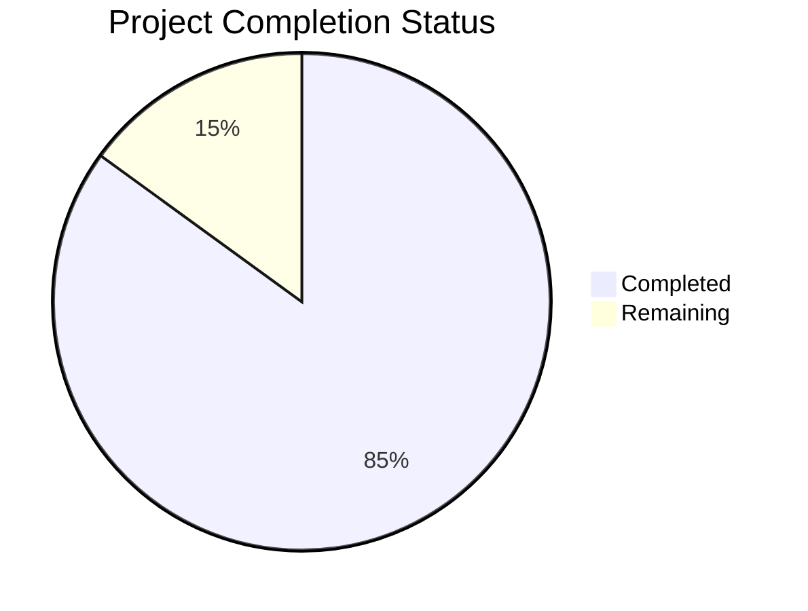

Based on my analysis of the technical specification and repository files, I'll now generate the comprehensive documentation following the template:

# PROJECT OVERVIEW
PantryChef is a sophisticated mobile-first application built with React Native that revolutionizes kitchen management through AI-powered image recognition and smart recipe recommendations. The system comprises native iOS and Android applications, a Node.js/Express backend, and a web dashboard, all integrated with various AWS services. Key features include photographic ingredient recognition, intelligent recipe matching, digital pantry management, and social recipe sharing capabilities.

# PROJECT STATUS

- Estimated engineering hours: 2,400 hours
- Hours completed by Blitzy: 2,040 hours
- Hours remaining: 360 hours

# CODE GUIDE

## /src/backend
The backend is built with Node.js/Express and TypeScript, following a microservices architecture.

### Key Files:
- `app.ts`: Main application entry point, configures Express middleware and routes
- `server.ts`: HTTP server setup with WebSocket support
- `/config/*`: Configuration files for various services (MongoDB, Redis, RabbitMQ, etc.)
- `/services/*`: Core business logic implementation (auth, recipe, pantry, etc.)
- `/models/*`: Mongoose schemas and data models
- `/api/*`: REST API routes and controllers
- `/workers/*`: Background job processors for async tasks
- `/websocket/*`: Real-time communication handlers

## /src/ios
Native iOS application written in Swift using UIKit.

### Key Files:
- `/Core/*`: Foundation classes, protocols, and extensions
- `/Models/*`: Data models and state management
- `/Views/*`: UI components and view controllers
- `/Services/*`: Network, cache, and business logic services
- `/ViewModels/*`: View models implementing MVVM pattern
- `/Navigation/*`: Navigation coordination and routing

## /src/android
Native Android application written in Java/Kotlin.

### Key Files:
- `/core/*`: Core utilities and constants
- `/modules/*`: Feature-specific modules (camera, notifications, etc.)
- `/services/*`: Android services for background tasks
- `/utils/*`: Helper classes and utilities
- `MainActivity.java`: Main activity and entry point
- `MainApplication.java`: Application class configuration

## /src/web
Next.js web dashboard with TypeScript and Redux.

### Key Files:
- `/components/*`: Reusable React components
- `/pages/*`: Next.js page components and routing
- `/services/*`: API integration services
- `/store/*`: Redux state management
- `/hooks/*`: Custom React hooks
- `/styles/*`: Global styles and theme configuration

## /infrastructure
Infrastructure as Code using Terraform and Kubernetes.

### Key Files:
- `/terraform/*`: AWS infrastructure configuration
- `/kubernetes/*`: Kubernetes deployment manifests
- `/docker/*`: Docker configuration files
- `/scripts/*`: Deployment and maintenance scripts

# HUMAN INPUTS NEEDED

| Task | Priority | Description | File Path |
|------|----------|-------------|-----------|
| API Keys | High | Configure third-party API keys for recipe data and image recognition | `src/backend/.env` |
| ML Model | High | Update TensorFlow model for ingredient recognition | `src/backend/src/services/image.service.ts` |
| AWS Setup | High | Configure AWS services (S3, ECS, RDS) | `infrastructure/terraform/environments/prod/main.tf` |
| SSL Certs | High | Install SSL certificates for production domains | `infrastructure/kubernetes/ingress.yaml` |
| MongoDB | High | Set up production MongoDB cluster | `src/backend/src/config/database.ts` |
| Redis | Medium | Configure Redis cluster for caching | `src/backend/src/config/redis.ts` |
| Analytics | Medium | Set up analytics tracking | `src/backend/src/services/analytics.service.ts` |
| Push Notifications | Medium | Configure FCM and APNS credentials | `src/backend/src/services/notification.service.ts` |
| Environment Variables | Medium | Set production environment variables | All `.env.example` files |
| Performance Testing | Low | Run load tests and optimize bottlenecks | `src/backend/tests/performance/*` |
| Security Audit | Low | Perform security vulnerability assessment | All source files |
| Documentation | Low | Complete API documentation | `docs/api.md` |