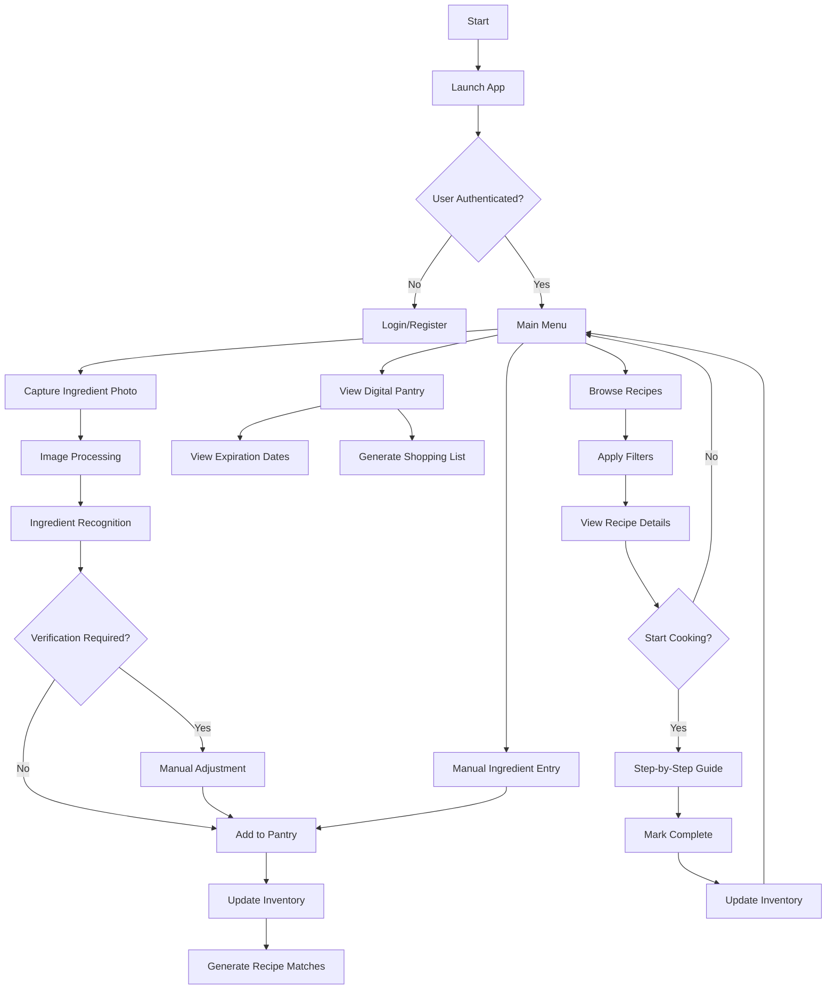
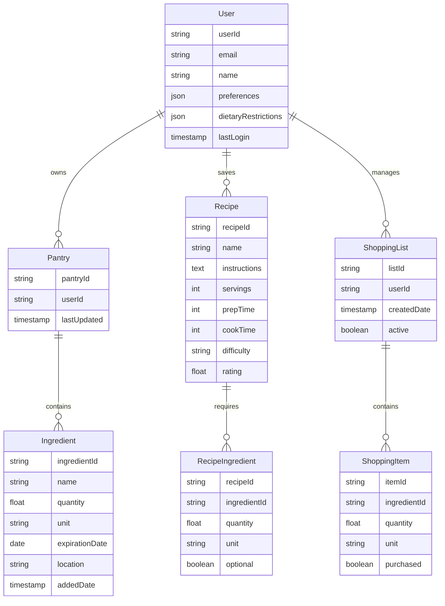
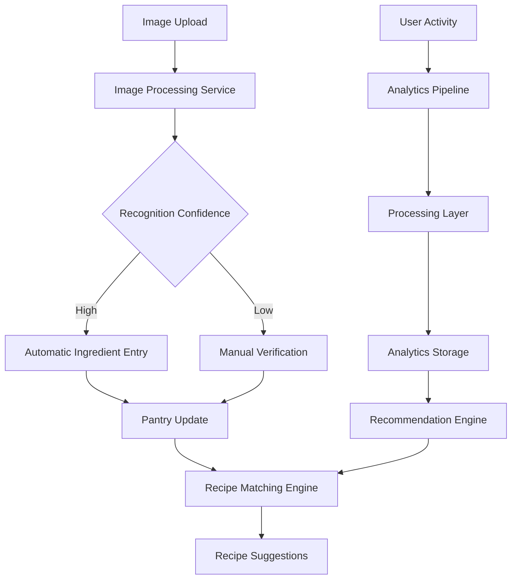
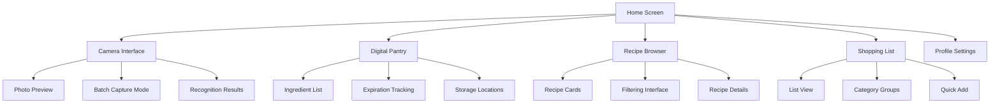

# 1. INTRODUCTION

## 1.1 Purpose
This Software Requirements Specification (SRS) document provides a comprehensive description of the PantryChef mobile application. It details the functional and non-functional requirements for developers, project managers, QA teams, and stakeholders involved in the development process. The document serves as the primary reference for technical and functional requirements during the application's development lifecycle and will be used for system design, implementation, and validation.

## 1.2 Scope
PantryChef is a mobile-first application designed to transform how users manage their kitchen ingredients and discover recipes. The system encompasses:

- Ingredient recognition through photo capture and processing
- Smart recipe recommendation engine based on available ingredients
- Digital pantry management system with expiration tracking
- Comprehensive recipe experience platform
- User preference and dietary restriction management

Key benefits include:
- Reduction of household food waste
- Simplified meal planning and preparation
- Personalized recipe discovery
- Efficient kitchen inventory management
- Time and cost savings in meal planning

The application will be available on iOS and Android platforms, with a complementary web dashboard for enhanced functionality. Core system boundaries include:

| In Scope | Out of Scope |
|----------|--------------|
| Ingredient photo recognition | Grocery delivery fulfillment |
| Recipe database and matching | Physical inventory management |
| Digital pantry tracking | Kitchen appliance control |
| User preference management | Meal preparation services |
| Shopping list generation | Restaurant recommendations |
| Recipe sharing and social features | Nutritionist consultations |
| Basic dietary tracking | Medical dietary planning |

## 2.1 Product Perspective
PantryChef operates as a standalone mobile application that integrates with device hardware (camera, storage) and external services. The system architecture consists of:

- Mobile applications (iOS/Android) for primary user interaction
- Cloud-based backend infrastructure for image processing and recipe matching
- External APIs for recipe databases and ingredient information
- Web dashboard for extended functionality
- Local device storage for offline capabilities

The application interfaces with:

| System Component | Integration Purpose |
|-----------------|---------------------|
| Device Camera | Ingredient photo capture |
| Local Storage | Offline data and image caching |
| Cloud Services | Image recognition processing |
| Recipe APIs | Recipe database access |
| User Authentication | Account management |
| Push Notification Services | Expiration alerts and updates |

## 2.2 Product Functions
The core functions of PantryChef include:

1. Ingredient Management
   - Photo-based ingredient recognition
   - Manual ingredient entry and editing
   - Expiration date tracking
   - Storage location organization

2. Recipe Discovery
   - Intelligent recipe matching algorithm
   - Dietary restriction filtering
   - Ingredient substitution suggestions
   - Recipe rating and review system

3. Pantry Organization
   - Digital inventory management
   - Shopping list generation
   - Usage tracking and analytics
   - Expiration notifications

4. Recipe Experience
   - Step-by-step cooking instructions
   - Serving size adjustments
   - Progress tracking
   - Recipe collection management

## 2.3 User Characteristics
Target users fall into three primary categories:

1. Home Cooks
   - Age range: 25-45
   - Basic to intermediate cooking skills
   - Smartphone proficient
   - Time-conscious
   - Values reducing food waste

2. Meal Planners
   - Primary household food managers
   - Organization-focused
   - Regular grocery shoppers
   - Budget-conscious
   - Interested in efficiency

3. Recipe Enthusiasts
   - Advanced cooking skills
   - Active in recipe sharing
   - Interested in culinary exploration
   - Social media engaged
   - Regular recipe contributors

## 2.4 Constraints

1. Technical Constraints
   - Mobile device camera quality requirements
   - Internet connectivity for full functionality
   - Storage limitations for offline data
   - Processing power for image recognition
   - Battery consumption considerations

2. Business Constraints
   - Recipe database licensing requirements
   - Third-party API usage limits
   - Data privacy regulations compliance
   - Market-specific content restrictions
   - Monetization model limitations

3. System Constraints
   - Cross-platform compatibility requirements
   - Real-time processing limitations
   - Database size management
   - Concurrent user capacity
   - Image recognition accuracy thresholds

## 2.5 Assumptions and Dependencies

Assumptions:
- Users have smartphones with cameras capable of 8MP+ resolution
- Stable internet connection available for primary functions
- Users willing to photograph ingredients regularly
- Basic understanding of cooking terminology
- Access to common cooking ingredients

Dependencies:
- Third-party image recognition services
- Recipe database providers
- Cloud infrastructure availability
- Mobile platform app stores
- Authentication service providers
- Push notification services
- Payment processing systems (for premium features)

## 2.6 Process Flowchart

## 3. FUNCTIONAL REQUIREMENTS

### 3.1 Ingredient Recognition System

#### FR-IR1: Photo Capture and Processing
| ID | Description | Priority |
|----|-------------|----------|
| FR-IR1.1 | System shall allow users to capture photos of ingredients using device camera | High |
| FR-IR1.2 | System shall process multiple ingredients in a single photo | High |
| FR-IR1.3 | System shall support batch processing of multiple photos in one session | Medium |
| FR-IR1.4 | System shall perform image preprocessing for optimal recognition | High |
| FR-IR1.5 | System shall function in various lighting conditions | Medium |

#### FR-IR2: Ingredient Identification
| ID | Description | Priority |
|----|-------------|----------|
| FR-IR2.1 | System shall identify common grocery items with 90% accuracy | High |
| FR-IR2.2 | System shall provide confidence scores for identified items | Medium |
| FR-IR2.3 | System shall allow manual correction of misidentified items | High |
| FR-IR2.4 | System shall learn from manual corrections to improve accuracy | Low |
| FR-IR2.5 | System shall support manual ingredient entry as alternative | High |

### 3.2 Recipe Discovery Engine

#### FR-RD1: Recipe Matching
| ID | Description | Priority |
|----|-------------|----------|
| FR-RD1.1 | System shall match recipes based on available ingredients | High |
| FR-RD1.2 | System shall suggest recipes missing maximum 2 ingredients | High |
| FR-RD1.3 | System shall consider ingredient quantities in matches | Medium |
| FR-RD1.4 | System shall provide ingredient substitution suggestions | Medium |
| FR-RD1.5 | System shall update suggestions in real-time as inventory changes | Medium |

#### FR-RD2: Recipe Filtering
| ID | Description | Priority |
|----|-------------|----------|
| FR-RD2.1 | System shall filter recipes based on dietary restrictions | High |
| FR-RD2.2 | System shall sort recipes by prep time, difficulty, match percentage | High |
| FR-RD2.3 | System shall provide quick recipe options (5 ingredients or less) | Medium |
| FR-RD2.4 | System shall learn and adapt to user preferences | Low |
| FR-RD2.5 | System shall support cuisine-based filtering | Medium |

### 3.3 Pantry Management

#### FR-PM1: Inventory Control
| ID | Description | Priority |
|----|-------------|----------|
| FR-PM1.1 | System shall maintain digital inventory of ingredients | High |
| FR-PM1.2 | System shall track expiration dates | High |
| FR-PM1.3 | System shall organize items by storage location | Medium |
| FR-PM1.4 | System shall provide inventory history | Low |
| FR-PM1.5 | System shall track ingredient usage | Medium |

#### FR-PM2: Shopping Management
| ID | Description | Priority |
|----|-------------|----------|
| FR-PM2.1 | System shall generate shopping lists automatically | High |
| FR-PM2.2 | System shall provide restock reminders | Medium |
| FR-PM2.3 | System shall notify users of expiring ingredients | High |
| FR-PM2.4 | System shall allow manual shopping list editing | High |
| FR-PM2.5 | System shall track shopping history | Low |

### 3.4 Recipe Experience

#### FR-RE1: Recipe Interaction
| ID | Description | Priority |
|----|-------------|----------|
| FR-RE1.1 | System shall provide step-by-step cooking instructions | High |
| FR-RE1.2 | System shall support adjustable serving sizes | High |
| FR-RE1.3 | System shall include integrated cooking timers | Medium |
| FR-RE1.4 | System shall allow recipe notes and modifications | Medium |
| FR-RE1.5 | System shall track cooking progress | Medium |

#### FR-RE2: Recipe Management
| ID | Description | Priority |
|----|-------------|----------|
| FR-RE2.1 | System shall support recipe favorites collection | High |
| FR-RE2.2 | System shall enable recipe ratings and reviews | Medium |
| FR-RE2.3 | System shall support recipe sharing | Medium |
| FR-RE2.4 | System shall maintain recipe history | Low |
| FR-RE2.5 | System shall allow recipe customization | Medium |

## 4. NON-FUNCTIONAL REQUIREMENTS

### 4.1 Performance Requirements

| ID | Requirement | Target Metric |
|----|-------------|---------------|
| NFR-P1 | Image recognition processing time | ≤ 3 seconds per image |
| NFR-P2 | Recipe matching response time | ≤ 1 second for up to 50 ingredients |
| NFR-P3 | Application launch time | ≤ 2 seconds on supported devices |
| NFR-P4 | Maximum concurrent users | 100,000 active users |
| NFR-P5 | Offline data sync time | ≤ 30 seconds on 4G connection |
| NFR-P6 | Maximum storage usage | ≤ 500MB excluding cached images |
| NFR-P7 | Battery consumption | ≤ 5% per hour of active use |
| NFR-P8 | API response time | ≤ 200ms for 95% of requests |

### 4.2 Safety Requirements

| ID | Requirement | Description |
|----|-------------|-------------|
| NFR-S1 | Data Backup | Automated daily backups with 30-day retention |
| NFR-S2 | Failure Recovery | System state recovery within 5 minutes of failure |
| NFR-S3 | Data Validation | Input validation for all user-entered data |
| NFR-S4 | Error Handling | Graceful error handling with user notifications |
| NFR-S5 | Version Control | Rollback capability for all system updates |
| NFR-S6 | Data Integrity | Checksums for all data transmissions |
| NFR-S7 | Conflict Resolution | Automated conflict resolution for concurrent updates |
| NFR-S8 | Disaster Recovery | Recovery Point Objective (RPO) of 1 hour |

### 4.3 Security Requirements

| ID | Requirement | Description |
|----|-------------|-------------|
| NFR-SE1 | Authentication | Multi-factor authentication support |
| NFR-SE2 | Data Encryption | AES-256 encryption for data at rest |
| NFR-SE3 | Communication | TLS 1.3 for all network communications |
| NFR-SE4 | Session Management | Automatic session timeout after 30 minutes |
| NFR-SE5 | Access Control | Role-based access control (RBAC) |
| NFR-SE6 | Password Policy | Minimum 8 characters with complexity requirements |
| NFR-SE7 | Data Privacy | GDPR and CCPA compliance measures |
| NFR-SE8 | Audit Logging | Comprehensive security event logging |

### 4.4 Quality Requirements

#### 4.4.1 Availability
- System uptime: 99.9% excluding planned maintenance
- Maximum planned downtime: 4 hours per month
- Unplanned downtime recovery: < 1 hour
- Redundancy for critical components

#### 4.4.2 Maintainability
- Modular architecture with loose coupling
- Automated deployment processes
- Comprehensive system documentation
- Code coverage minimum 80%
- Automated testing suite

#### 4.4.3 Usability
- Maximum 3 clicks to reach any feature
- Interface response time < 100ms
- Support for accessibility standards (WCAG 2.1)
- Intuitive navigation structure
- Consistent UI/UX patterns

#### 4.4.4 Scalability
- Horizontal scaling capability
- Auto-scaling based on load
- Database partitioning support
- Content delivery network integration
- Microservices architecture support

#### 4.4.5 Reliability
- Mean Time Between Failures (MTBF): > 720 hours
- Mean Time To Repair (MTTR): < 1 hour
- Error rate: < 0.1% of all transactions
- Data durability: 99.999%
- Automated system health monitoring

### 4.5 Compliance Requirements

| ID | Requirement | Description |
|----|-------------|-------------|
| NFR-C1 | Data Protection | GDPR and CCPA compliance |
| NFR-C2 | Accessibility | WCAG 2.1 Level AA compliance |
| NFR-C3 | Mobile Standards | iOS App Store and Google Play Store guidelines |
| NFR-C4 | Security Standards | OWASP Top 10 security compliance |
| NFR-C5 | Payment Processing | PCI DSS compliance for payment features |
| NFR-C6 | Data Storage | Local data protection regulations compliance |
| NFR-C7 | API Standards | REST API design standards compliance |
| NFR-C8 | Documentation | ISO/IEC/IEEE 29148:2018 compliance |

## 5. DATA REQUIREMENTS

### 5.1 Data Models

### 5.2 Data Storage

#### 5.2.1 Primary Storage
| Data Type | Storage System | Retention Period |
|-----------|----------------|------------------|
| User Profiles | Document DB | Account lifetime |
| Pantry Data | Document DB | Account lifetime |
| Recipe Data | Document DB | Permanent |
| Images | Object Storage | 30 days |
| Usage Analytics | Time-series DB | 12 months |
| Session Data | In-memory Cache | 24 hours |

#### 5.2.2 Backup and Recovery
| Requirement | Specification |
|-------------|---------------|
| Backup Frequency | Daily full, hourly incremental |
| Backup Retention | 30 days |
| Recovery Time Objective | < 4 hours |
| Recovery Point Objective | < 1 hour |
| Redundancy | Multi-region replication |
| Backup Encryption | AES-256 |

### 5.3 Data Processing

#### 5.3.1 Data Security Controls
| Layer | Security Measure |
|-------|-----------------|
| Transport | TLS 1.3 encryption |
| Storage | Field-level encryption |
| Processing | Secure compute isolation |
| Access | Role-based access control |
| Audit | Comprehensive logging |

#### 5.3.2 Data Processing Requirements
| Process | Requirement |
|---------|-------------|
| Image Recognition | < 3s processing time |
| Recipe Matching | < 1s response time |
| Analytics Processing | Near real-time |
| Data Synchronization | < 30s delay |
| Batch Processing | Daily schedule |

### 5.4 Data Integration

| System | Integration Type | Data Flow |
|--------|-----------------|-----------|
| Recipe APIs | REST API | Inbound |
| Analytics Services | Event Stream | Outbound |
| Authentication | OAuth 2.0 | Bidirectional |
| Storage Services | SDK | Bidirectional |
| Backup Services | Automated | Outbound |

### 5.5 Data Governance

| Aspect | Requirement |
|--------|-------------|
| Data Classification | PII, Public, Internal |
| Data Ownership | User-owned personal data |
| Data Access | Least privilege principle |
| Data Lifecycle | Defined retention policies |
| Compliance | GDPR, CCPA compliant |

## 6. EXTERNAL INTERFACES

### 6.1 User Interfaces

#### 6.1.1 Mobile Application Interface Requirements

| Interface Element | Requirement |
|------------------|-------------|
| Minimum Touch Target | 44x44 points |
| Text Size | 16pt minimum for primary content |
| Color Contrast | WCAG 2.1 AA compliant (4.5:1 ratio) |
| Screen Orientation | Support for both portrait and landscape |
| Navigation | Bottom tab bar with maximum 5 primary functions |
| Gestures | Support for standard platform gestures |
| Loading States | Skeleton screens for content loading |
| Error States | Clear error messaging with recovery actions |

#### 6.1.2 Critical Interface Screens

### 6.2 Hardware Interfaces

#### 6.2.1 Camera Interface
| Requirement | Specification |
|-------------|---------------|
| Minimum Resolution | 8 megapixels |
| Auto-focus | Required |
| Flash Control | API access required |
| Preview Feed | Real-time access |
| Image Stabilization | Hardware/Software support |

#### 6.2.2 Storage Interface
| Component | Requirement |
|-----------|-------------|
| Internal Storage | Minimum 100MB reserved |
| External Storage | Optional SD card support |
| Cache Storage | Maximum 1GB allocation |
| Temp Storage | Minimum 50MB allocation |

### 6.3 Software Interfaces

#### 6.3.1 External Service Integration

| Service | Interface Type | Purpose |
|---------|---------------|----------|
| Image Recognition API | REST/HTTPS | Ingredient identification |
| Recipe Database API | GraphQL | Recipe data access |
| Authentication Service | OAuth 2.0 | User authentication |
| Analytics Service | REST/HTTPS | Usage tracking |
| Push Notification Service | FCM/APNS | User notifications |

#### 6.3.2 Operating System Interfaces

| OS Feature | Interface Requirement |
|------------|---------------------|
| Camera API | Native camera access |
| File System | Secure storage access |
| Notifications | Local/Push notification support |
| Background Processing | Background task support |
| Location Services | Optional location access |

### 6.4 Communication Interfaces

#### 6.4.1 Network Protocols

| Protocol | Usage |
|----------|--------|
| HTTPS | Primary API communication |
| WebSocket | Real-time updates |
| MQTT | IoT device communication |
| gRPC | High-performance services |

#### 6.4.2 Data Exchange Formats

| Format | Purpose |
|--------|---------|
| JSON | REST API responses |
| Protocol Buffers | Binary data transfer |
| GraphQL | Recipe data queries |
| MessagePack | Efficient data serialization |

#### 6.4.3 API Requirements

| Requirement | Specification |
|-------------|---------------|
| Authentication | JWT tokens |
| Rate Limiting | 100 requests/minute |
| Timeout | 30 second maximum |
| Compression | gzip for responses |
| Caching | ETags support |
| Versioning | URI versioning |

## APPENDICES

### A. GLOSSARY

| Term | Definition |
|------|------------|
| Batch Processing | Processing multiple photos or items simultaneously in a single operation |
| Confidence Score | Numerical value indicating the system's certainty in ingredient recognition |
| Digital Pantry | Virtual representation of user's available ingredients and their details |
| Edge Case | Unusual or extreme situation that requires special handling in the system |
| Match Percentage | Degree of compatibility between available ingredients and recipe requirements |
| Recognition Pattern | Machine learning model's understanding of ingredient visual characteristics |
| Skeleton Screen | Placeholder UI showing layout while content loads |
| Storage Location | Physical location where ingredients are stored (pantry, refrigerator, freezer) |
| Substitution | Alternative ingredient that can replace another in a recipe |

### B. ACRONYMS

| Acronym | Definition |
|---------|------------|
| AES | Advanced Encryption Standard |
| APNS | Apple Push Notification Service |
| CCPA | California Consumer Privacy Act |
| FCM | Firebase Cloud Messaging |
| GDPR | General Data Protection Regulation |
| JWT | JSON Web Token |
| MQTT | Message Queuing Telemetry Transport |
| OWASP | Open Web Application Security Project |
| PCI DSS | Payment Card Industry Data Security Standard |
| PII | Personally Identifiable Information |
| RBAC | Role-Based Access Control |
| REST | Representational State Transfer |
| RPO | Recovery Point Objective |
| TLS | Transport Layer Security |
| WCAG | Web Content Accessibility Guidelines |

### C. ADDITIONAL REFERENCES

| Reference | Description | URL |
|-----------|-------------|-----|
| iOS Human Interface Guidelines | Apple's design guidelines for iOS applications | https://developer.apple.com/design/human-interface-guidelines/ |
| Material Design Guidelines | Google's design system for Android applications | https://material.io/design |
| WCAG 2.1 Guidelines | Web accessibility guidelines | https://www.w3.org/WAI/standards-guidelines/wcag/ |
| OWASP Mobile Security Guide | Mobile application security best practices | https://owasp.org/www-project-mobile-security/ |
| ISO/IEC/IEEE 29148:2018 | Systems and software engineering requirements | https://www.iso.org/standard/72089.html |

### D. TECHNOLOGY STACK

| Component | Technology |
|-----------|------------|
| Mobile Frontend | React Native |
| Backend Services | Node.js, Express |
| Database | MongoDB |
| Image Processing | TensorFlow, OpenCV |
| Cache Layer | Redis |
| Message Queue | RabbitMQ |
| Search Engine | Elasticsearch |
| Analytics | Google Analytics |
| Cloud Infrastructure | AWS |
| CI/CD | Jenkins |