# 1. INTRODUCTION

## 1.1 System Overview
PantryChef is a comprehensive mobile-first application built on React Native that transforms kitchen management and recipe discovery through intelligent image recognition and personalized recipe recommendations. The system comprises:

- Mobile applications for iOS and Android platforms
- Node.js/Express backend services hosted on AWS
- MongoDB database for user and recipe data management
- TensorFlow-powered image recognition system
- Elasticsearch-based recipe search engine
- Redis caching layer for performance optimization
- RabbitMQ message queue for asynchronous processing
- Real-time WebSocket connections for live updates
- RESTful APIs for third-party integrations

The system architecture follows a microservices pattern, with distinct services handling:
- Image recognition and processing
- Recipe matching and recommendations
- Inventory management
- User authentication and profiles
- Analytics and reporting
- Push notifications

## 1.2 Scope
PantryChef addresses the challenges of food waste and meal planning through intelligent technology integration. The system encompasses:

### Core Capabilities
- Photographic ingredient recognition and cataloging
- Smart recipe matching based on available ingredients
- Digital pantry management with expiration tracking
- Personalized recipe recommendations
- Shopping list generation and management
- Social recipe sharing and community features

### Key Benefits
- Reduced household food waste through inventory tracking
- Time savings in meal planning and preparation
- Cost reduction through efficient ingredient usage
- Improved cooking experience with guided recipes
- Simplified grocery shopping process

### System Boundaries

| Included | Excluded |
|----------|-----------|
| Ingredient recognition via photo | Direct grocery ordering |
| Recipe database and matching | Food delivery services |
| Digital pantry tracking | Smart appliance control |
| Shopping list generation | Meal kit services |
| Basic nutritional information | Detailed nutrition analysis |
| Recipe sharing | Professional recipe development |
| User preference management | Dietary consultation |
| Expiration tracking | Inventory automation |

The system will be delivered through:
- Native iOS application (iOS 13+)
- Native Android application (Android 8+)
- Web dashboard for extended functionality
- RESTful APIs for third-party integration
- Administrative backend for content management

# 5. SYSTEM ARCHITECTURE

## 5.1 High-Level Architecture Overview

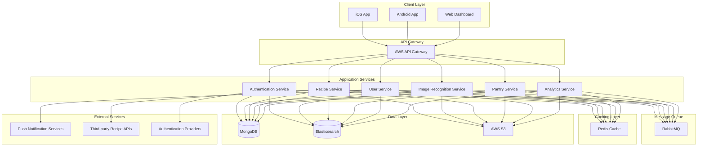

## 5.2 Component Architecture

### 5.2.1 Client Applications

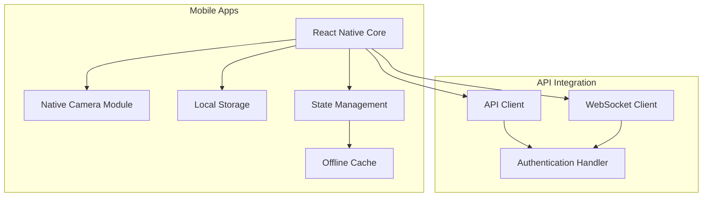

### 5.2.2 Backend Services Architecture

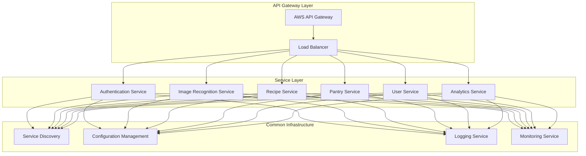

## 5.3 Technology Stack Details

### 5.3.1 Frontend Stack
| Layer | Technology |
|-------|------------|
| UI Framework | React Native |
| State Management | Redux |
| API Client | Axios |
| Real-time Communication | Socket.io Client |
| Image Processing | React Native Camera |
| Local Storage | AsyncStorage |
| UI Components | React Native Paper |

### 5.3.2 Backend Stack
| Layer | Technology |
|-------|------------|
| Runtime | Node.js |
| API Framework | Express.js |
| Authentication | JWT, OAuth2.0 |
| Image Processing | TensorFlow.js |
| Search Engine | Elasticsearch |
| Message Queue | RabbitMQ |
| Cache | Redis |
| Database | MongoDB |

## 5.4 Data Flow Architecture

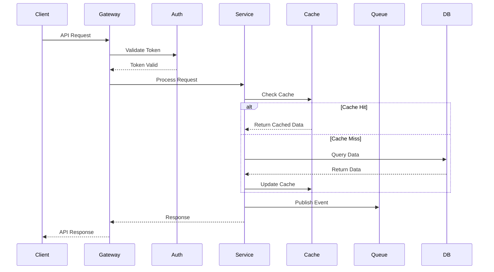

## 5.5 Deployment Architecture

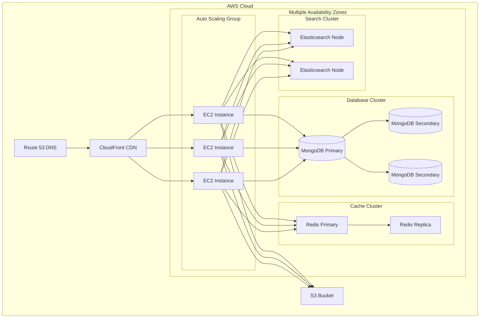

## 5.6 Security Architecture

| Security Layer | Implementation |
|----------------|----------------|
| Network | AWS VPC, Security Groups |
| Application | JWT, OAuth2.0, Rate Limiting |
| Data | AES-256 Encryption |
| Transport | TLS 1.3 |
| Monitoring | AWS CloudWatch, CloudTrail |
| Access Control | IAM, RBAC |

## 6. SYSTEM COMPONENTS

### 6.1 Component Diagrams

#### 6.1.1 Core System Components

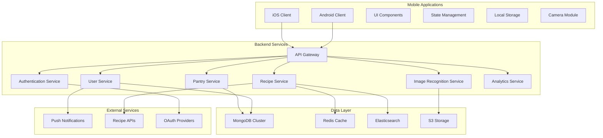

#### 6.1.2 Image Recognition Component

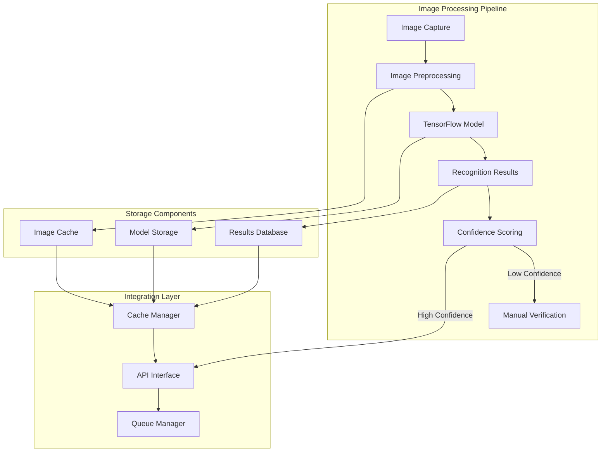

### 6.2 Sequence Diagrams

#### 6.2.1 Ingredient Recognition Flow

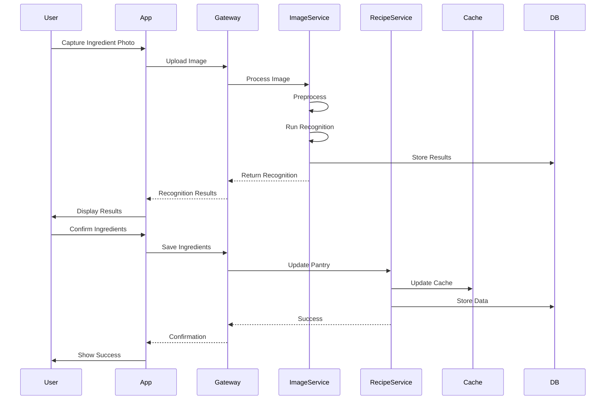

#### 6.2.2 Recipe Matching Flow

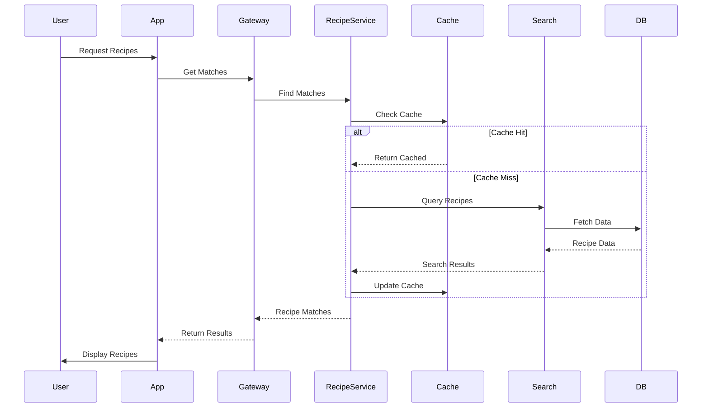

### 6.3 Data Flow Diagram

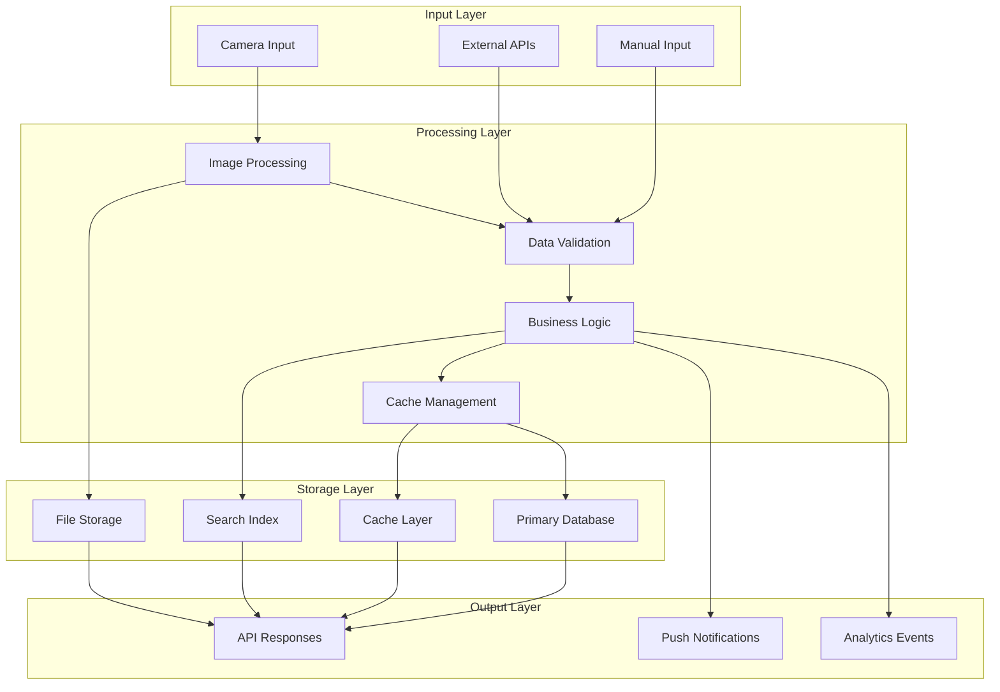

### 6.4 Component Specifications

| Component | Technology | Purpose | Dependencies |
|-----------|------------|---------|--------------|
| UI Layer | React Native | User interface rendering | Redux, React Navigation |
| State Management | Redux | Application state control | Redux Thunk, Redux Persist |
| API Gateway | Express.js | Request routing and validation | JWT, Express Validator |
| Image Service | TensorFlow.js | Image recognition processing | OpenCV, Sharp |
| Recipe Service | Node.js | Recipe matching and management | Elasticsearch, MongoDB |
| Cache Layer | Redis | Performance optimization | Redis Cluster |
| Search Engine | Elasticsearch | Recipe and ingredient search | Elasticsearch Client |
| Message Queue | RabbitMQ | Asynchronous processing | AMQP Client |
| Storage Service | AWS S3 | Image and file storage | AWS SDK |
| Database | MongoDB | Primary data storage | Mongoose ODM |

# 7. TECHNOLOGY STACK

## 7.1 Programming Languages

| Platform | Language | Justification |
|----------|----------|---------------|
| Mobile Apps | TypeScript/JavaScript | React Native cross-platform development, strong typing support |
| Backend Services | Node.js | Consistent JavaScript ecosystem, high performance for I/O operations |
| Image Processing | Python | Rich ecosystem of ML/CV libraries, TensorFlow integration |
| Database Scripts | JavaScript | MongoDB native support, consistent with backend |
| DevOps | YAML/Shell | Infrastructure configuration, deployment automation |

## 7.2 Frameworks and Libraries

### 7.2.1 Frontend Frameworks

| Framework | Purpose | Key Features |
|-----------|---------|--------------|
| React Native | Mobile app development | Cross-platform, native performance |
| Redux | State management | Predictable state container |
| React Navigation | Navigation | Screen management, deep linking |
| React Native Paper | UI components | Material Design implementation |
| Socket.io Client | Real-time communication | WebSocket abstraction |
| Axios | HTTP client | Promise-based requests |

### 7.2.2 Backend Frameworks

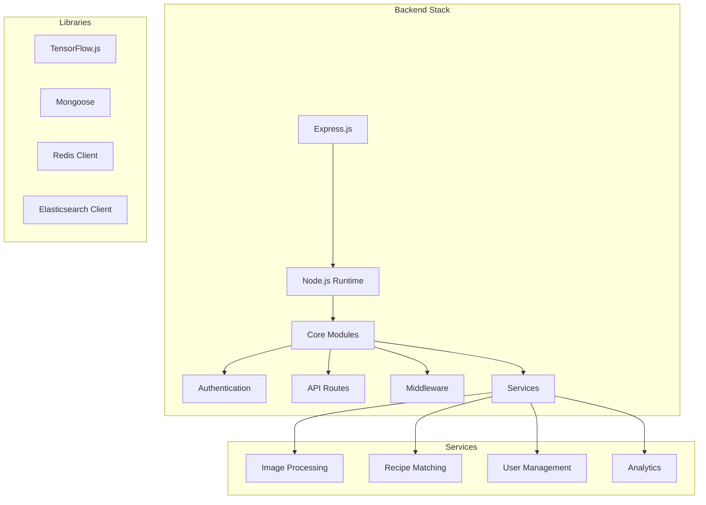

## 7.3 Databases and Storage

| System | Technology | Purpose |
|--------|------------|---------|
| Primary Database | MongoDB | User data, recipes, pantry management |
| Cache Layer | Redis | Session management, frequent queries |
| Search Engine | Elasticsearch | Recipe and ingredient search |
| File Storage | AWS S3 | Image storage, static assets |
| Message Queue | RabbitMQ | Asynchronous task processing |

## 7.4 Third-Party Services

### 7.4.1 Cloud Services (AWS)

| Service | Purpose |
|---------|---------|
| EC2 | Application hosting |
| ELB | Load balancing |
| RDS | Database backup |
| CloudFront | CDN |
| Route 53 | DNS management |
| CloudWatch | Monitoring |

### 7.4.2 External APIs

| Service | Purpose | Integration Type |
|---------|---------|-----------------|
| Spoonacular | Recipe data | REST API |
| Firebase Auth | Authentication | SDK |
| Google Vision API | Image recognition backup | REST API |
| Stripe | Payment processing | SDK |
| SendGrid | Email notifications | REST API |
| OneSignal | Push notifications | SDK |

## 7.5 Development and Deployment Tools

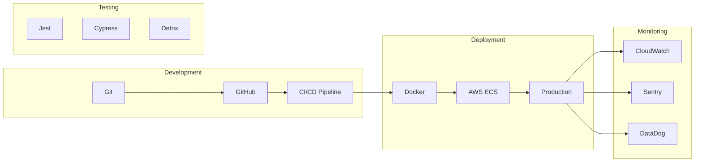

## 7.6 Development Environment

| Tool | Purpose |
|------|---------|
| VS Code | Primary IDE |
| XCode | iOS development |
| Android Studio | Android development |
| Postman | API testing |
| MongoDB Compass | Database management |
| Redis Commander | Cache monitoring |
| Docker Desktop | Container management |

# 8. SYSTEM DESIGN

## 8.1 User Interface Design

### 8.1.1 Mobile Application Layout

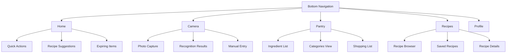

### 8.1.2 Screen Components

| Screen | Key Components | Functionality |
|--------|----------------|---------------|
| Home | Quick Action Bar, Recipe Cards, Status Widgets | Dashboard view with immediate actions |
| Camera | Camera Preview, Recognition Results, Edit Panel | Ingredient capture and verification |
| Pantry | Category Tabs, Item List, Search Bar | Inventory management |
| Recipes | Filter Panel, Recipe Grid, Sort Options | Recipe discovery and management |
| Profile | Settings List, Preferences Panel, Account Info | User configuration |

### 8.1.3 Navigation Flow

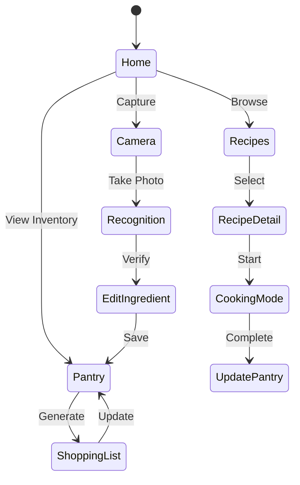

## 8.2 Database Design

### 8.2.1 Collections Schema

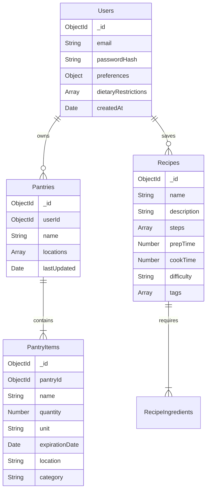

### 8.2.2 Indexes

| Collection | Index | Type | Purpose |
|------------|-------|------|---------|
| Users | email | Unique | Login lookup |
| PantryItems | pantryId + name | Compound | Item queries |
| Recipes | tags | Multikey | Recipe search |
| RecipeIngredients | recipeId | Single | Recipe composition |

## 8.3 API Design

### 8.3.1 REST Endpoints

| Endpoint | Method | Purpose | Request Body | Response |
|----------|--------|---------|--------------|-----------|
| /api/v1/ingredients/recognize | POST | Image recognition | Image file | Recognized ingredients |
| /api/v1/pantry/items | GET | List pantry items | - | Item array |
| /api/v1/recipes/match | POST | Find matching recipes | Ingredients array | Recipe matches |
| /api/v1/shopping-list | PUT | Update shopping list | Items array | Updated list |

### 8.3.2 WebSocket Events

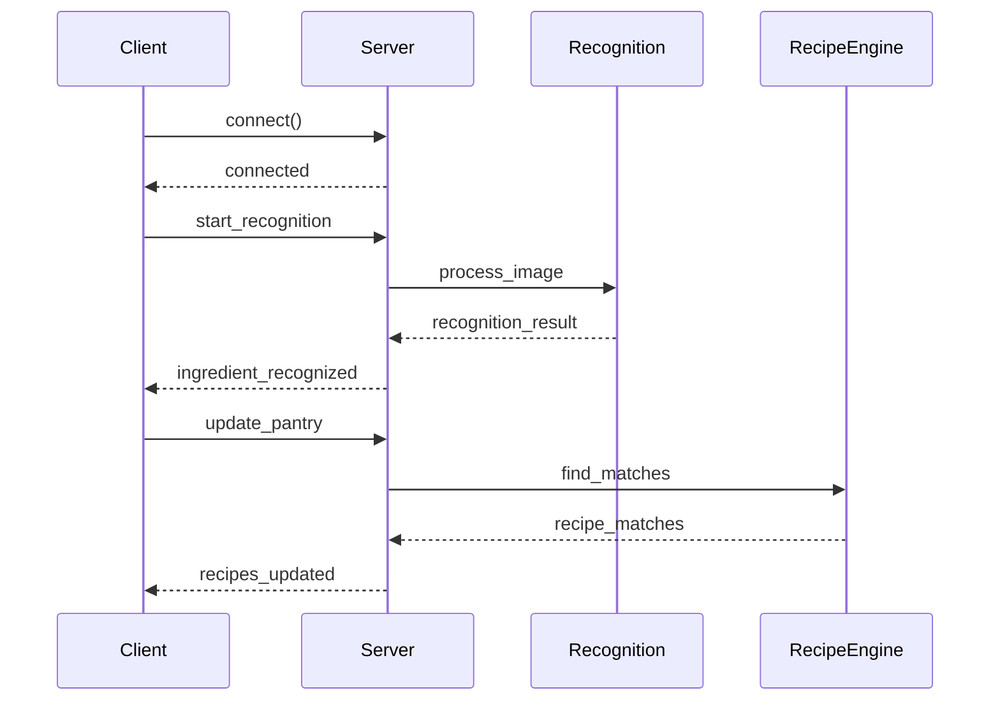

### 8.3.3 Service Integration

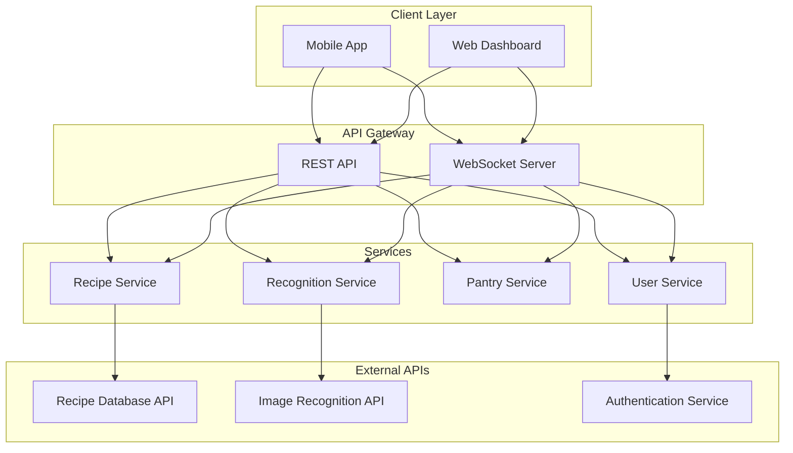

### 8.3.4 Data Flow

| Process | Source | Destination | Format | Protocol |
|---------|--------|-------------|---------|-----------|
| Image Upload | Mobile App | Recognition Service | Multipart/form-data | HTTPS |
| Recognition Results | Recognition Service | Pantry Service | JSON | Internal RPC |
| Recipe Match | Recipe Service | Mobile App | JSON | WebSocket |
| User Auth | Auth Service | API Gateway | JWT | HTTPS |

# 9. SECURITY CONSIDERATIONS

## 9.1 Authentication and Authorization

### 9.1.1 Authentication Flow

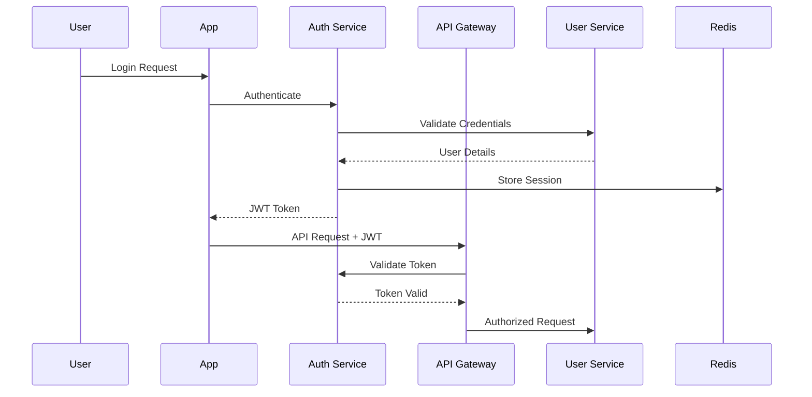

### 9.1.2 Authorization Matrix

| Role | Pantry Access | Recipe Management | User Management | Analytics | Admin Functions |
|------|---------------|-------------------|-----------------|-----------|-----------------|
| User | Own Only | Read/Create/Edit | Own Profile | None | None |
| Premium User | Own Only | Read/Create/Edit/Share | Own Profile | Basic | None |
| Content Manager | None | Create/Edit/Delete | None | Basic | Recipe Management |
| Administrator | All | All | All | Full | All |

## 9.2 Data Security

### 9.2.1 Encryption Standards

| Data Type | At Rest | In Transit | Key Management |
|-----------|----------|------------|----------------|
| User Credentials | AES-256 | TLS 1.3 | AWS KMS |
| Personal Information | AES-256 | TLS 1.3 | AWS KMS |
| Payment Details | PCI DSS Compliant | TLS 1.3 | Third-party Processing |
| Session Data | AES-256 | TLS 1.3 | Redis Encryption |
| Images | AES-256 | TLS 1.3 | S3 Encryption |

### 9.2.2 Data Protection Flow

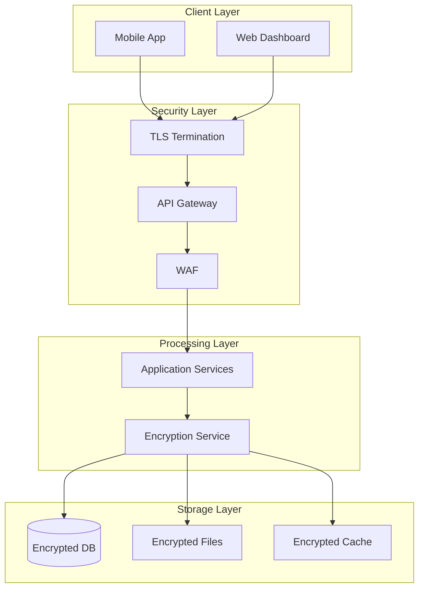

## 9.3 Security Protocols

### 9.3.1 Access Control Measures

| Control Type | Implementation | Purpose |
|--------------|----------------|----------|
| Authentication | JWT + OAuth2.0 | Identity verification |
| Session Management | Redis + JWT | Maintain user sessions |
| Rate Limiting | Express Rate Limit | Prevent abuse |
| IP Filtering | CloudFront + WAF | Block malicious traffic |
| Device Verification | Device Fingerprinting | Prevent unauthorized access |

### 9.3.2 Security Monitoring

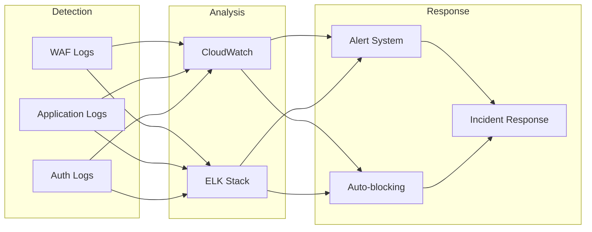

### 9.3.3 Security Compliance Requirements

| Standard | Requirement | Implementation |
|----------|-------------|----------------|
| GDPR | Data Protection | Encryption, Access Controls |
| CCPA | Privacy Rights | User Data Portal |
| OWASP | Security Best Practices | Security Headers, Input Validation |
| PCI DSS | Payment Security | Third-party Processing |
| SOC 2 | Security Controls | Audit Logging, Monitoring |

### 9.3.4 Incident Response Protocol

```mermaid
stateDiagram-v2
    [*] --> Detection
    Detection --> Analysis
    Analysis --> Containment
    Containment --> Eradication
    Eradication --> Recovery
    Recovery --> PostIncident
    PostIncident --> [*]

    Detection: Automated/Manual Detection
    Analysis: Impact Assessment
    Containment: Limit Damage
    Eradication: Remove Threat
    Recovery: Restore Services
    PostIncident: Review and Update
```

### 9.3.5 Security Update Management

| Component | Update Frequency | Process |
|-----------|-----------------|----------|
| Dependencies | Weekly | Automated scanning and updates |
| OS Patches | Monthly | Scheduled maintenance window |
| Security Patches | As needed | Emergency deployment process |
| SSL Certificates | 90 days | Automated renewal |
| Security Policies | Quarterly | Review and update cycle |

# 10. INFRASTRUCTURE

## 10.1 Deployment Environment

```mermaid
graph TB
    subgraph Production Environment
        A[AWS Cloud Infrastructure]
        B[Multi-Region Deployment]
        C[High Availability Setup]
    end
    
    subgraph Staging Environment
        D[AWS Development Region]
        E[Testing Infrastructure]
    end
    
    subgraph Development Environment
        F[Local Development]
        G[Docker Containers]
    end
    
    F --> G
    G --> D
    D --> E
    E --> A
    A --> B
    B --> C
```

| Environment | Purpose | Configuration |
|-------------|---------|---------------|
| Development | Local development and testing | Docker containers, local databases |
| Staging | Integration testing and QA | Scaled-down production replica |
| Production | Live application serving | Multi-AZ, auto-scaling groups |
| DR Site | Disaster recovery | Cross-region replication |

## 10.2 Cloud Services

### 10.2.1 AWS Service Stack

| Service | Purpose | Configuration |
|---------|---------|---------------|
| ECS | Container orchestration | Auto-scaling, multi-AZ |
| RDS | MongoDB database hosting | Multi-AZ, automated backups |
| ElastiCache | Redis caching layer | Cluster mode enabled |
| S3 | Image and static storage | Cross-region replication |
| CloudFront | CDN for static assets | Global edge locations |
| Route 53 | DNS management | Latency-based routing |
| ELB | Load balancing | Application Load Balancer |
| CloudWatch | Monitoring and logging | Custom metrics, alerts |
| KMS | Key management | Automatic key rotation |

### 10.2.2 High Availability Architecture

```mermaid
graph TB
    subgraph Region 1
        A[ALB Primary] --> B[ECS Cluster]
        B --> C[RDS Primary]
        B --> D[ElastiCache Primary]
    end
    
    subgraph Region 2
        E[ALB Secondary] --> F[ECS Cluster]
        F --> G[RDS Secondary]
        F --> H[ElastiCache Secondary]
    end
    
    I[Route 53] --> A
    I[Route 53] --> E
    C --> G
    D --> H
```

## 10.3 Containerization

### 10.3.1 Docker Configuration

| Component | Base Image | Purpose |
|-----------|------------|---------|
| API Service | node:16-alpine | Backend API services |
| Image Processing | python:3.9-slim | TensorFlow processing |
| Frontend | node:16-alpine | React Native web build |
| Queue Worker | node:16-alpine | Background job processing |
| Monitoring | grafana/grafana | Metrics visualization |

### 10.3.2 Container Architecture

```mermaid
graph TB
    subgraph Docker Compose Development
        A[API Container]
        B[Processing Container]
        C[Frontend Container]
        D[Worker Container]
        E[MongoDB Container]
        F[Redis Container]
    end
    
    A --> E
    A --> F
    B --> E
    C --> A
    D --> E
    D --> F
```

## 10.4 Orchestration

### 10.4.1 ECS Configuration

| Service | Task Definition | Scaling Policy |
|---------|----------------|----------------|
| API Service | 2 vCPU, 4GB RAM | Target tracking - CPU 70% |
| Image Processing | 4 vCPU, 8GB RAM | Target tracking - Memory 80% |
| Queue Worker | 2 vCPU, 4GB RAM | Queue depth based |
| Frontend | 1 vCPU, 2GB RAM | Request count based |

### 10.4.2 Service Mesh

```mermaid
graph LR
    subgraph ECS Cluster
        A[API Tasks] --> B[Service Discovery]
        C[Processing Tasks] --> B
        D[Worker Tasks] --> B
        B --> E[App Mesh]
        E --> F[Load Balancer]
    end
```

## 10.5 CI/CD Pipeline

### 10.5.1 Pipeline Architecture

```mermaid
graph LR
    A[GitHub] --> B[Jenkins]
    B --> C[Unit Tests]
    C --> D[Build Containers]
    D --> E[Integration Tests]
    E --> F[Security Scan]
    F --> G[Deploy Staging]
    G --> H[E2E Tests]
    H --> I[Deploy Production]
```

### 10.5.2 Deployment Process

| Stage | Actions | Success Criteria |
|-------|---------|-----------------|
| Build | Code compilation, container building | All builds pass |
| Test | Unit tests, integration tests | 100% test coverage |
| Security | SAST, container scanning | No critical vulnerabilities |
| Staging | Deploy to staging environment | All health checks pass |
| Production | Blue-green deployment | Zero downtime deployment |

### 10.5.3 Monitoring and Rollback

| Component | Monitoring | Rollback Strategy |
|-----------|------------|-------------------|
| API Services | Health checks, latency metrics | Previous ECS task definition |
| Database | Connection pool, query performance | Point-in-time recovery |
| Cache | Hit rate, memory usage | Cache rebuild |
| CDN | Cache hit ratio, latency | Distribution rollback |
| Containers | CPU, memory, network | Previous image version |

# APPENDICES

### A. GLOSSARY

| Term | Definition |
|------|------------|
| API Gateway | Entry point for all client-side requests that handles routing and authentication |
| Auto-scaling | Automatic adjustment of computational resources based on demand |
| CDN | Content delivery network for distributing static assets globally |
| Edge Location | Geographic location where content is cached for faster delivery |
| ETL Pipeline | Extract, Transform, Load process for data processing |
| Load Balancer | System that distributes incoming network traffic across servers |
| Microservice | Independently deployable service that handles a specific business function |
| Service Mesh | Infrastructure layer for facilitating service-to-service communication |
| Task Definition | Specification of container parameters in ECS |
| WebSocket | Protocol providing full-duplex communication channels over TCP |

### B. ACRONYMS

| Acronym | Full Form |
|---------|------------|
| ALB | Application Load Balancer |
| AMQP | Advanced Message Queuing Protocol |
| AWS | Amazon Web Services |
| ECS | Elastic Container Service |
| IAM | Identity and Access Management |
| KMS | Key Management Service |
| ODM | Object Document Mapper |
| RPC | Remote Procedure Call |
| SAST | Static Application Security Testing |
| SDK | Software Development Kit |
| VPC | Virtual Private Cloud |
| WAF | Web Application Firewall |

### C. SYSTEM METRICS

```mermaid
graph LR
    subgraph Performance Metrics
        A[Response Time] --> B[< 200ms API]
        A --> C[< 3s Image Processing]
        D[Throughput] --> E[1000 req/sec]
        D --> F[100 concurrent uploads]
    end

    subgraph Reliability Metrics
        G[Uptime] --> H[99.9% availability]
        I[Error Rate] --> J[< 0.1% requests]
    end

    subgraph Resource Metrics
        K[CPU Usage] --> L[< 70% threshold]
        M[Memory] --> N[< 80% threshold]
    end
```

### D. DEPLOYMENT CHECKLIST

| Category | Item | Description |
|----------|------|-------------|
| Infrastructure | VPC Configuration | Network isolation and security groups |
| | ECS Cluster Setup | Container orchestration environment |
| | RDS Configuration | Database cluster configuration |
| Security | SSL Certificates | TLS certificate installation |
| | IAM Roles | Service access permissions |
| | KMS Keys | Encryption key management |
| Monitoring | CloudWatch | Metrics and logging setup |
| | Alert Configuration | Critical threshold notifications |
| | Health Checks | Endpoint monitoring |
| Backup | Database Backup | Automated backup schedule |
| | S3 Replication | Cross-region file replication |
| | State Management | Application state persistence |

### E. ERROR CODES

```mermaid
graph TB
    subgraph Client Errors 4XX
        A[400 Bad Request]
        B[401 Unauthorized]
        C[403 Forbidden]
        D[404 Not Found]
        E[429 Too Many Requests]
    end

    subgraph Server Errors 5XX
        F[500 Internal Error]
        G[502 Bad Gateway]
        H[503 Service Unavailable]
        I[504 Gateway Timeout]
    end

    subgraph Custom Errors
        J[ERR_IMG_PROCESS]
        K[ERR_RECIPE_MATCH]
        L[ERR_SYNC_FAIL]
    end
```

### F. INTEGRATION ENDPOINTS

| Service | Endpoint | Method | Purpose |
|---------|----------|--------|----------|
| Image Recognition | /api/v1/recognize | POST | Process ingredient photos |
| Recipe Service | /api/v1/recipes/match | GET | Find matching recipes |
| Pantry Service | /api/v1/pantry/items | PUT | Update inventory |
| User Service | /api/v1/users/preferences | PATCH | Update user settings |
| Analytics | /api/v1/events | POST | Track user actions |
| Authentication | /api/v1/auth/token | POST | Generate access tokens |