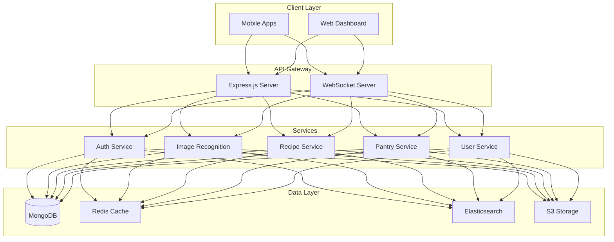

# PantryChef Backend Service

## Overview

PantryChef's backend service is a high-performance, scalable Node.js/Express application that powers intelligent kitchen management through advanced image recognition, real-time recipe matching, and comprehensive pantry tracking capabilities. The service is built with TypeScript and follows a microservices architecture pattern for optimal scalability and maintainability.

## Architecture

The backend service is composed of several key components:

- **Express.js API Server**: RESTful API endpoints with JWT authentication
- **WebSocket Server**: Real-time updates with Socket.IO
- **MongoDB Cluster**: Distributed database with replica sets
- **Redis Cache**: High-performance caching and session management
- **RabbitMQ**: Message queue for asynchronous task processing
- **Elasticsearch**: Powerful recipe and ingredient search engine
- **TensorFlow.js**: Image recognition and processing
- **AWS S3**: Secure image and file storage

## Prerequisites

- Node.js >= 16.0.0
- MongoDB >= 5.0.0 with replica set support
- Redis >= 6.0.0 with cluster mode
- RabbitMQ >= 3.9.0
- Elasticsearch >= 8.0.0
- Docker and Docker Compose (for containerized development)

## Installation

1. Clone the repository and set up environment variables:
```bash
git clone <repository-url>
cd src/backend
cp .env.example .env
```

2. Install dependencies:
```bash
npm install
```

3. Build the TypeScript project:
```bash
npm run build
```

## Development

Start the development server with hot-reload:
```bash
npm run dev
```

### Docker Development Environment

Run the complete development stack using Docker Compose:
```bash
docker-compose -f docker/docker-compose.dev.yml up
```

## Testing

Run the test suite:
```bash
npm run test
```

## Production Deployment

1. Build the production bundle:
```bash
npm run build
```

2. Start the production server:
```bash
npm start
```

### Docker Production Deployment

Deploy using production Docker configuration:
```bash
docker-compose -f docker/docker-compose.yml up
```

## API Documentation

### Authentication Endpoints
- Base Path: `/api/v1/auth/*`
- Security: JWT with OAuth2.0
- Rate Limiting: Implemented
- Session Management: Redis-based

### Image Recognition Endpoints
- Base Path: `/api/v1/recognition/*`
- Performance: Sub-200ms response time
- Supported Formats: JPEG, PNG
- Max File Size: 10MB

### Recipe Management Endpoints
- Base Path: `/api/v1/recipes/*`
- Caching: Redis cluster
- Search: Elasticsearch-powered
- Real-time Updates: WebSocket support

### Pantry Management Endpoints
- Base Path: `/api/v1/pantry/*`
- Storage: MongoDB with replication
- Concurrency: Optimistic locking
- Events: Real-time notifications

### User Management Endpoints
- Base Path: `/api/v1/users/*`
- Security: Role-based access control
- Profile Management: Full CRUD operations
- Preferences: User-specific settings

## Contributing

1. Fork the repository
2. Create a feature branch
3. Commit your changes
4. Push to the branch
5. Create a Pull Request

### Development Guidelines

- Follow TypeScript best practices
- Maintain test coverage above 80%
- Use ESLint for code style consistency
- Document all public APIs
- Follow semantic versioning

## Architecture Overview



## High Availability Architecture

The backend service is deployed across multiple availability zones with:

- Auto-scaling groups for compute resources
- MongoDB replica sets for data redundancy
- Redis cluster for distributed caching
- Load balancing across multiple instances
- Health monitoring and auto-recovery
- Cross-region disaster recovery

## Security Measures

- TLS 1.3 encryption for all traffic
- JWT-based authentication
- Role-based access control (RBAC)
- Rate limiting and DDoS protection
- Input validation and sanitization
- Regular security audits and updates
- AWS KMS for key management
- Secure secret management

## Monitoring and Logging

- AWS CloudWatch integration
- Performance metrics tracking
- Error tracking and alerting
- Request/response logging
- Resource utilization monitoring
- Custom metric collection
- Automated health checks

## License

MIT License - see LICENSE file for details

## Support

For technical support or questions:
- Create an issue in the repository
- Contact the development team
- Check the documentation wiki

---

For more information about PantryChef, visit our [main documentation](../../README.md).